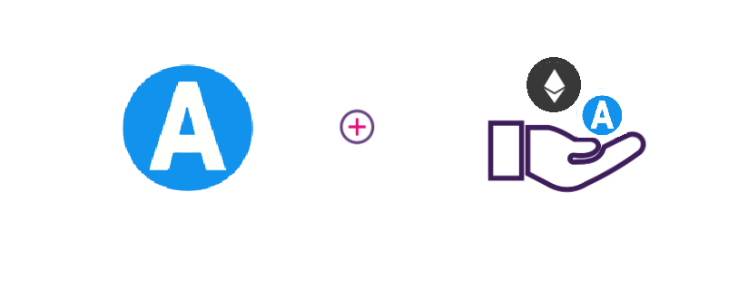

## Introduction
Remix is one of the commonly used development environments for smart contracts on Ethereum. Given AXIA’s Ethereum compatibility features, Remix can be used directly with AXIA network.
This guide walks through the process of creating and deploying a Solidity-based smart contract to AXIA’s testnet using the Remix IDE. This guide can be adapted for AXIA’s mainnet also. 
MetaMask allows users to store and manage account keys, broadcast transactions, send and receive Ethereum-based cryptocurrencies and tokens, and securely connect to decentralized applications through a compatible web browser or the mobile app's built-in browser.
The application includes an integrated service for exchanging Ethereum tokens by aggregating several decentralized exchanges (DEXs) to find the best exchange rate. This feature, branded as MetaMask Swaps, charges a service fee of 0.875% of the transaction amount.

## Accessing AXIA AXChain​
AXChain exposes the same API as go-ethereum, so you can use all the familiar APIs that are available on Ethereum for interaction with the platform.
There are multiple ways of working with the AXChain.

 
 
## Checking Prerequisites
For the purposes of this guide, you'll need to have the following:

* Remix - https://remix.ethereum.org/
* [MetaMask](https://metamask.io/) installed and configured to use AXIA network
* You should have some funds in your Metamask account

## MetaMask​ Network Configuration
You can access AXChain through MetaMask, by defining a custom network. Go to MetaMask, log in, click the network dropdown, and select 'Custom RPC'. Data for AXIA is as follows.

### AXIA Mainnet Settings:​
* Network Name: AXIA Mainnet AXChain
* New RPC URL: https://1.p2p-v2.mainnet.axiacoin.network/ext/bc/AX/rpc
* ChainID: 4001
* Symbol: AXC
* Explorer: https://appchain-v2.mainnet.axiacoin.network/

### AXIA Testnet Settings:​
* Network Name: AXIA Testnet AXChain
* New RPC URL: https://1.p2p-v2.testnet.axiacoin.network/ext/bc/AX/rpc
* ChainID: 4000
* Symbol: AXC
* Explorer: https://appchain-v2.testnet.axiacoin.network/

## Connect MetaMask and deploy a smart contract using Remix

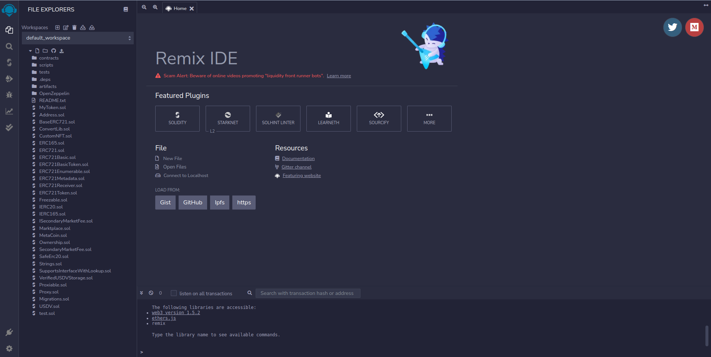

Now, you can head to Remix to get started. In the main screen, under Environments, select Solidity to configure Remix for Solidity development, then navigate to the File Explorers view.

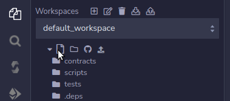

Create a file to write a smart contract and you can use https://docs.openzeppelin.com/contracts for any demo contract.
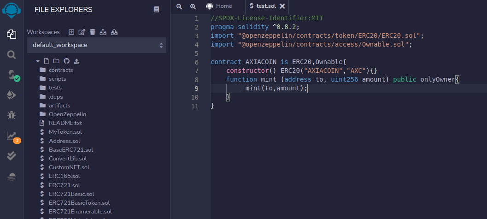

Now, navigate to the Compile sidebar option and press the Compile button. Ensure the solidity compiler version mentioned in the code and the solidity compiler version of the Remix IDE are the same.
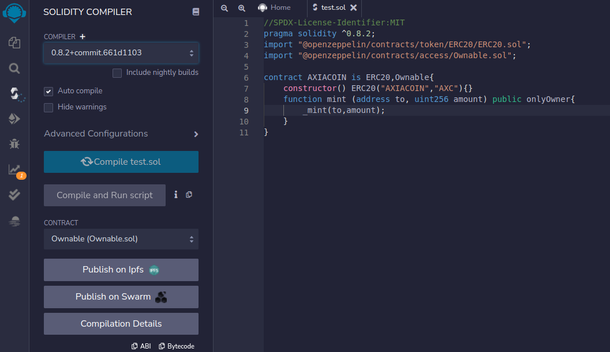

Then you can navigate to ‘DEPLOY & RUN TRANSACTION’ section in the sidebar.
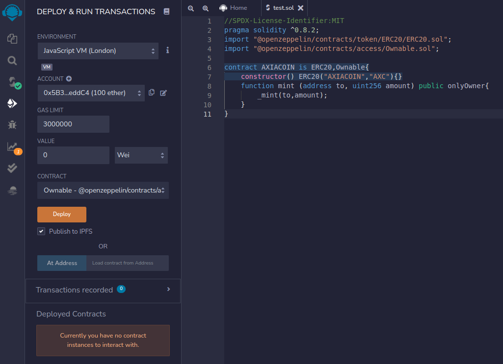

Now you can deploy the contract by navigating to the Deployment sidebar option. You need to change the topmost Environment dropdown from JavaScript VM to Injected Web3. This tells Remix to use the MetaMask injected provider, which will point it to your AXIA development node. 
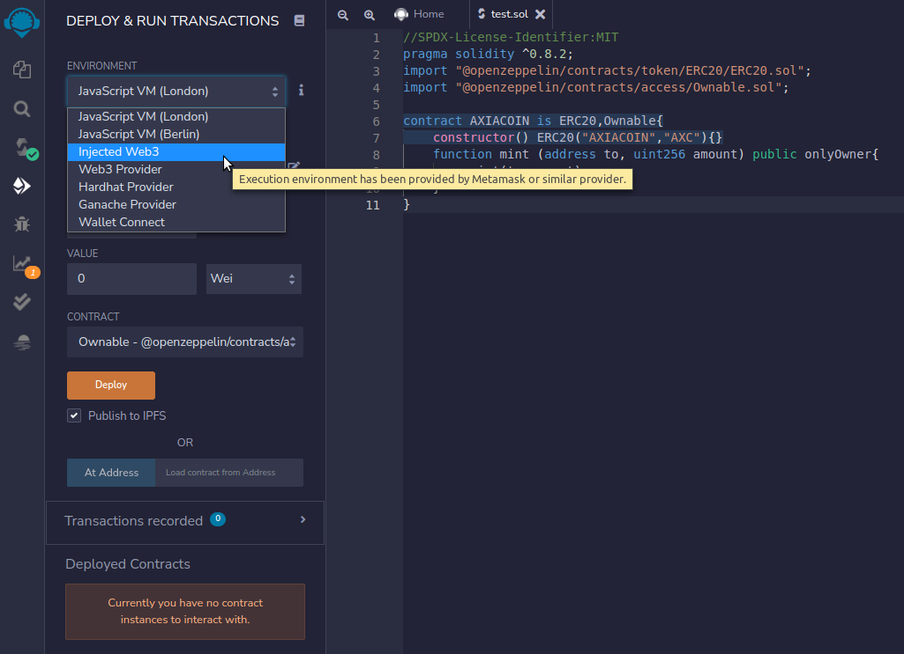

As soon as you select Injected Web3, you will be prompted to allow Remix to connect to your MetaMask account. Select ‘Next’.

Then select ‘Connect’ in Metamask to allow Remix to access the selected account.

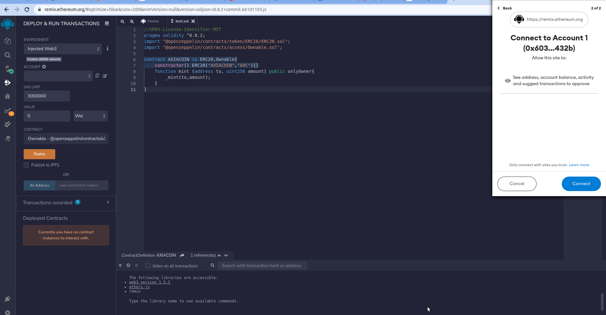

Back on Remix, you should see that the account you wish to use for deployment is now managed by MetaMask.

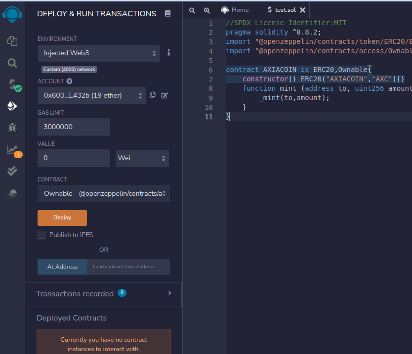

Then select the contract you want to deploy from the dropdown.

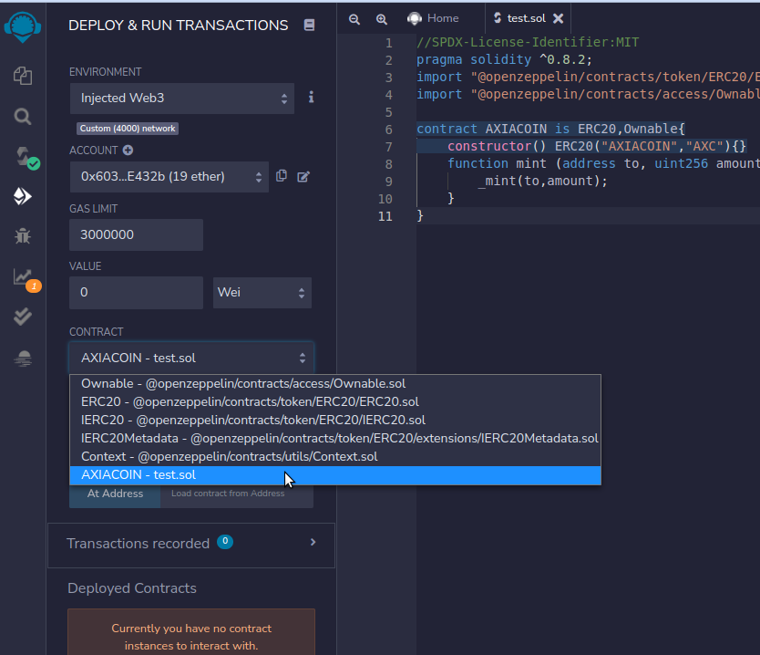

After selecting the contract, press ‘Deploy’ to deploy the smart contract in the AXIA network.

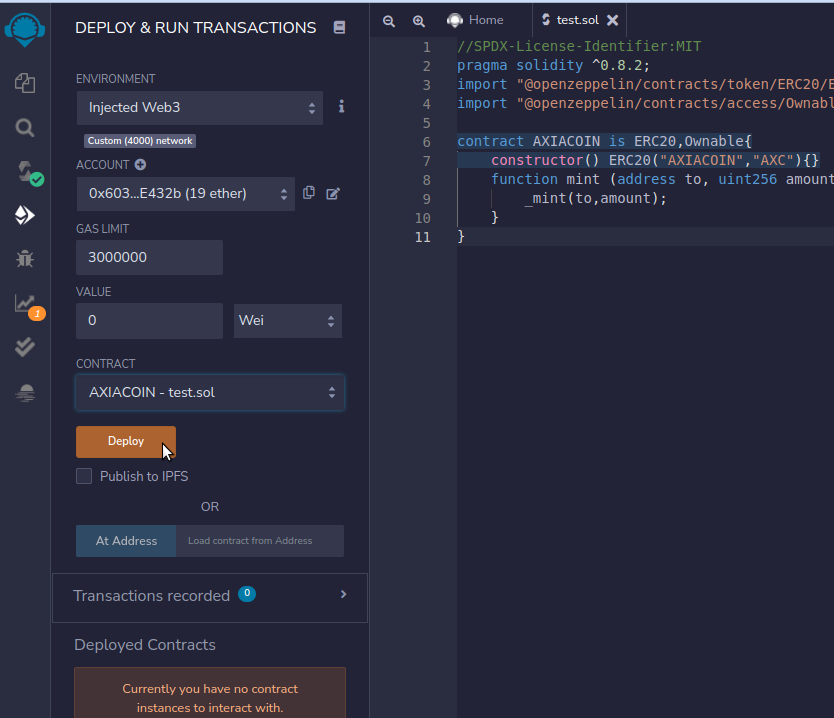

You will be prompted in MetaMask to confirm the contract deployment transaction.

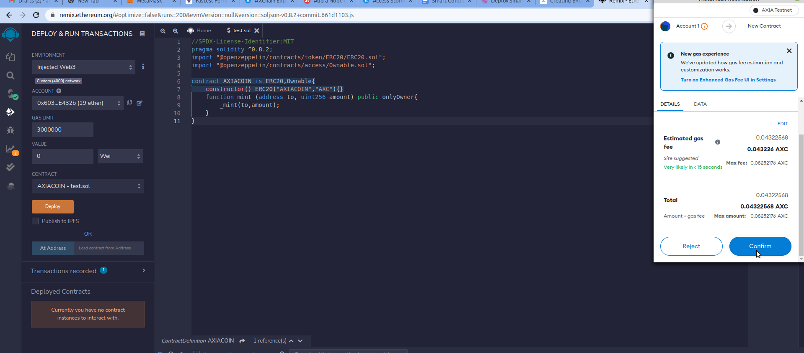

Congratulations your smart contract is deployed in the AXIA network, Once the contract is deployed, you can interact with it from within Remix.

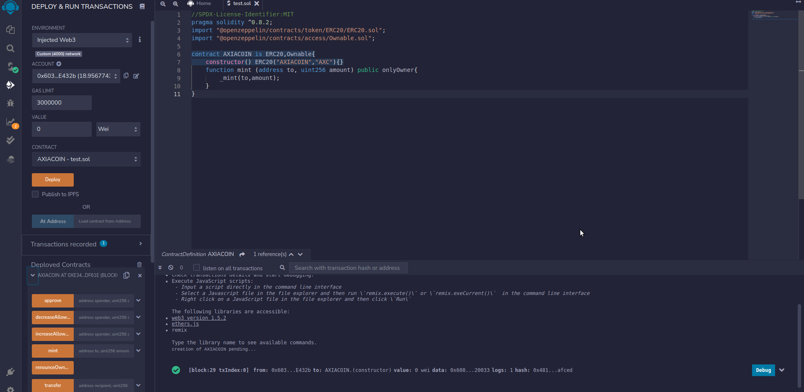

It's that easy! Once the contract is deployed, you'll see the address and all available read/write methods to interact with it.

