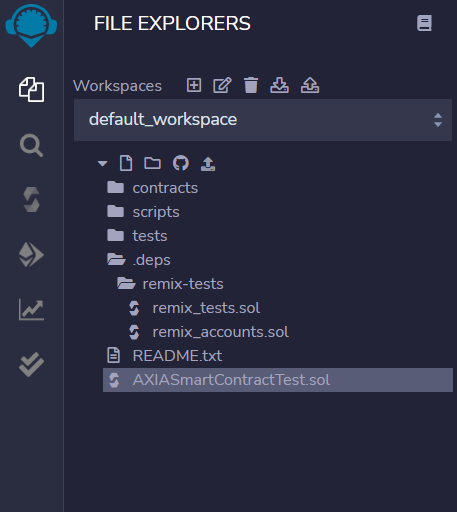
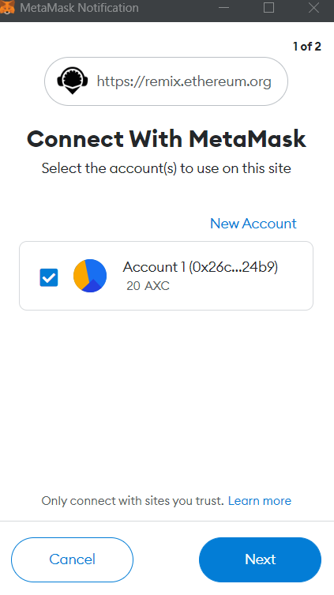
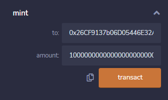
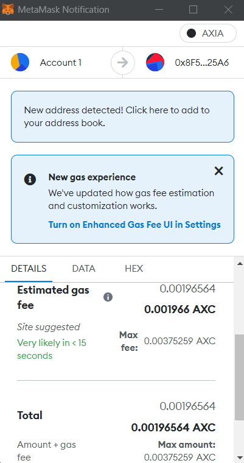
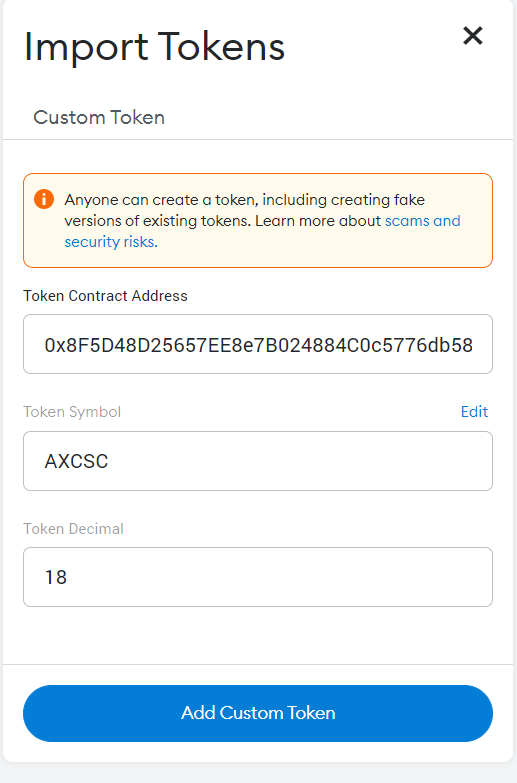
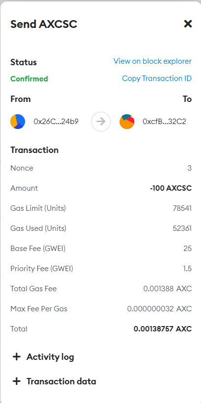

ERC-20 is the technical standard for fungible tokens created using the Ethereum blockchain. ERC20 stands for Ethereum Request for Comment, number 20. ERC-20 allows different smart-contract enabled tokens a way to be exchanged. Tokens, in this regard, are a representation of an asset, right, access, ownership, cryptocurrency, or anything else that is not unique in and of itself but can be transferred.


A new use cases and projects or an existing one which is running on Ethereum or different chains can be implemented to AXIA. Everyone can create their own standard and own token on AXIA AXChain Network.
Here we are creating our ownable and mintable ERC-20 token and will mint it to any address we want and we can also transfer this from one address to another address. The token will be generated on AXIA AXChain and will be accessible on that chain.

In this section we will see how we can deploy a smart contract written with Solidity to AXIA’s AXChain. This is the feature that AXIA provides us- to be able to deploy any smart contract on the chain and no requirement for a new language specific contract concept to interact. Let’s look at how to create an ERC-20 contract and deploy it to AXIA AXChain.

### Set up Metamask

To set up a Metamask wallet with current or existing wallet - follow the [Add AXIA to MetaMask](../docs/Metamask-Support) section.

### Network Configuration

* **Network Name:** AXIA AXChain
* **New RPC URL:**
   * Mainnet: https://1.p2p-v2.mainnet.axiacoin.network/ext/bc/AX/rpc
   * Testnet: https://1.p2p-v2.testnet.axiacoin.network/ext/bc/AX/rpc
* **ChainID:**
   * Mainnet: 4001
   * Testnet: 4000
* **Symbol:** AXC
* **Explorer:**
   * Mainnet: https://appchain-v2.mainnet.axiacoin.network
   * Testnet: https://appchain-v2.testnet.axiacoin.network


### Create mintable and ownable token

Lets continue with this tutorial, here we will see how we can create our mintable and ownable token on Remix. Open [Remix](https://remix.ethereum.org/) on your browser. Post creating a MetaMask wallet and connecting it to the AXIA Network then we need to connect the same account to the Remix.


You should view this page. On this page, first, click "File Explorer" from "Featured Plugins" and then click the "New File" button. When you click the New File button, you will see a pop-up that requires a file name. 



Now we can write an ERC20 token contract. For this you can paste the same code we are using.

```

//SPDX-License-Identifier:MIT

pragma solidity ^0.8.2;

import "@openzeppelin/contracts/token/ERC20/ERC20.sol";

import "@openzeppelin/contracts/access/Ownable.sol";


contract AXIACOIN is ERC20,Ownable{

constructor() ERC20("AXIASMARTCONTRACT","AXCSC"){}

function mint (address to, uint256 amount) public onlyOwner{

_mint(to,amount);

    }

}

```


Move to the compiler section of Remix and make sure the compiler version is same or newer than the one mentioned in the code.


Compile the code and it should be done without any issues. After that, go into the Deploy and Run section. And in that select Inject web3 option in Environment and select the contract to the file which we have created recently.


This will call out the MetaMask wallet and a popup will come up in your screen. 

 

Connect Metamask with Remix.


In remix press Deploy and that will open up MetaMask wallet and it will have transaction details.


 Confirm that and now the Smart contract has been successfully deployed. 


You can find the transaction hash and the other details in remix also.


### Interact with Smart Contract

Now we will Mint the Deployed smart contract with a given amount. For that select the Mint function and give a address of the wallet and the desired amount. 




Mint will also require some gas fees, and you will see a popup from metamask with the transaction details.



### Import Tokens in Metamask

To import the Tokens in MetaMask, select the import tokens option in MetMask and paste the contract address in it. It will automatically fetch the other values. Now in MetaMask you will see that the amount you had mint is showing in it as a custom token.



Select 'Add Custom Token' and the ERC20 Tokens will successfully imported.


You can transfer this token to other addresses too. Just make sure the other wallet has this token imported like we did earlier.


Press 'Next' and 'Confirm' it.



The Transferred ERC20 Token will be send to that address.


