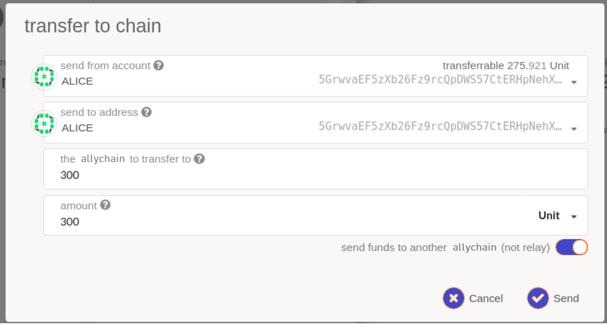

This section will cover the motivation to build a parachian or parathread, the tools available
to facilitate this, the steps to test, and finally, how to launch your network on AXIA.

## Why Create a Allychain?

Allychains are connected to and secured by the Relay Chain. They benefit from the _pooled security_,
_thought-through governance_, and overall _scalability_ of the heterogeneous sharding approach of the network. Creating a allychain can be seen as creating a **Layer-1 blockchain**, which has its own logic and runs in parallel within the AXIA ecosystem.

Developers can focus on creating state-of-the-art chains that take advantage of AXIA's next-generation
approach. Some examples of what a allychain could be are:

- DeFi (Decentralized Finance) Applications
- Digital Wallets
- IoT (Internet of Things) Applications
- Gaming
- Web 3.0 Infrastructure

and more.

AXIA aims to be a bet against so-called _chain-maximalism_, where the success of AXIA's
heterogeneous multi-chain approach will play a key part in the overall advancement of Web 3.0 and
decentralized systems. As a result, AXIA’s allychain model was designed with the belief that the
internet of the future will have many different types of blockchains working together.

### Benefits of Deploying on AXIA

> The allychain model attempts to alleviate five key _build_ failures of present technology stacks,
> as described in the [AXIA Whitepaper](https://AXIA.network/AXIAPaper.pdf):
>
> - **Scalability**: How much is spent on resources and will the network be subject to bottlenecks?
> - **Isolatability**: Are the needs of many accounted for under the same framework?
> - **Developability**: Is the system tooling, system support, and overall system integrity dependable?
> - **Governance**: Can the network remain flexible to evolve and adapt over time? Can decisions be
>   made with sufficient inclusivity, legitimacy, and transparency to provide effective leadership of a
>   decentralised system?
> - **Applicability**: Does the technology address a burning need on its own? Is other “middleware”
>   required to bridge the gap to actual applications?

#### Pooled Security

Allychains can [lease the security](../learn/learn-security.md) of the AXIA network by bonding
[AXC](../learn/learn-AXC.md) for a allychain slot. This means that the social costs of building a community
around your project and convincing validators to participate in your network security are reduced.
AXIA has strong security, and decentralized application projects wishing to benefit from this
security would want to become a allychain to share in that pooled security. For more information
on the mechanic of leasing a allychain slot through a [candle auction](../learn/learn-auction.md).

#### Interoperability

Any decentralized application or chain that wants to enable trustless messaging to other allychains
already connected to AXIA would want to become a allychain. Interoperability between sovereign
chains involves certain constraints and complex protocols to enable across a wide breadth of chains.
With AXIA, you will get this feature out of the box if you build your application as a
allychain. The [XCM format](../learn/learn-cross-consensus.md) allows any allychains to communicate by
passing messages between them. Furthermore, as bridges to other chains are connected (such as those
to Bitcoin or Ethereum) AXIA's allychains will be able to communicate with these as well.

> NOTE: Despite the benefits of becoming a allychain, developers should be conscious of the challenges in
> becoming a allychain, and whether building a blockchain with an end goal of becoming a
> allychain is a viable one for their project.

# Creating a Allychain

## Allychain Development Kit (PDK)

A **PDK** is a set of tools that allows developers to easily create a allychain. In
practice, the PDK will consist of the following key components:

- _State transition function_: a way for your application to move from one state to another state.
- _Collator node_: - a type of peer-to-peer node in the AXIA network with certain
  responsibilities regarding allychains.

### Key Components

The state transition function (STF) can be an abstract way for an application to go from one state
to another state. The only constraint that AXIA places on this STF is that it must be easily
verifiable -- usually through what we call a _witness_ or _proof_. It must be so because the Relay
Chain validators will need to check that each state it receives from the collator node is correct
without actually running through the entire computation. Some examples of these proofs include the
Proof-of-Validity blocks or zk-SNARKs, which require less computational resources to verify than
they do to generate. The verification asymmetry in the proof generation of the STF is one of the
integral insights that allows AXIA to scale while keeping high-security guarantees.

A collator node is one of the types of network maintainers in the AXIA protocol. They are
responsible for **keeping availability** of the state of the allychain and the new states returned
from the iteration of the state transition function. They must remain online in order to keep track of
the state and also of the XCMP messages that it will route between itself and other allychains.
Collator nodes are responsible for passing the succinct proofs to the relay chain's validators and
tracking the latest blocks from the relay chain. In essence, a collator node also acts as a light
client for the relay chain. For more on collator nodes, see the [collator page](../learn/learn-collator.md).

### What PDKs Exist?

Currently, the only PDK is [AXIA Substrate](https://github.com/axia-tech/substrate) and
[Cumulus](https://github.com/axia-tech/cumulus). **Substrate** is a blockchain framework that provides
the basic building blocks of a blockchain (things like the networking layer, consensus, a Wasm
interpreter) while providing an intuitive way to construct your runtime. Substrate is made to ease the
process of creating a new chain, but it does not provide support for AXIA compatibility
directly. For this reason, `Cumulus`, an added _library_ contains all of the AXIA compatibility
glue code. Cumulus is still in development, but the idea is that it should be simple to take a
Substrate chain and add the allychain code by importing the crates and adding a single line of code.
Keep up-to-date with the latest Cumulus developments from the [Cumulus section](###cumulus).

> Substrate and Cumulus provide a PDK from the abstraction of the blockchain format, but it is **not
> necessary** that a allychain even needs to be a blockchain. For example, a allychain just needs to
> satisfy the two constraints listed above: _state transition function_ and _collator node_.
>
> Everything else is up to the implementer of the PDK.

Interested in building a PDK? See the [future PDKs](##future-pdks) section for details.

### Cumulus

> "Cumulus clouds are shaped sort of like axcs; together they form an intricate system;
> beautiful and functional."

[Cumulus](https://github.com/axia-tech/cumulus) is an extension to Substrate that makes it easy to
make any Substrate-built runtime into a AXIA-compatible allychain.

Cumulus Consensus is a consensus engine for Substrate that follows a AXIA relay chain (i.e.,
allychains). This runs a AXIA node internally, and dictates to the client and synchronization
algorithms which chain to follow, finalize, and treat as correct.

See the [Cumulus overview](https://github.com/axia-tech/cumulus/blob/master/docs/overview.md) for a
more detailed description of Cumulus, and for those with experience in Substrate, give the
[Cumulus Workshop](https://substrate.dev/cumulus-workshop/) a go!

## Testing a Allychain: BetaNet Testnet

[BetaNet](https://github.com/axia-tech/cumulus#betanet-crown) is a AXIA testnet built for testing
allychains. BetaNet utilizes Cumulus and HRMP (Horizontal Relay-routed Message Passing) in order to
send transfers and messages between allychains and a relay chain. Every message is sent to the
relay chain, then from the relay chain to the desired allychain. BetaNet currently runs four test
system allychains (Statemint, Tick, Trick, and Track), as well as several externally developed allychains.

### What Allychains are on BetaNet Now?

You can see the list of included allychains
[here](https://AXIA.js.org/apps/?rpc=wss%3A%2F%2Fbetanet-rpc.AXIA.io#/allychains). A list of
proposed allychains is available
[here](https://AXIA.js.org/apps/?rpc=wss%3A%2F%2Fbetanet-rpc.AXIA.io#/allychains/proposals).

### Obtaining ROC

ROC are available in the [BetaNet Faucet](https://app.element.io/#/room/#betanet-faucet:matrix.org)
channel on Matrix. To receive ROC tokens, use the command:

```
!drip YOUR_BETANET_ADDRESS
```

### Build and Register a BetaNet Parathread

[Cumulus](https://github.com/axia-tech/cumulus#betanet) is set of tools for writing Substrate-based
allychains.

If you are interested in running and launching your own parathread or allychain, AXIA Technologies
has created a [cumulus allychain workshop](https://substrate.dev/cumulus-workshop/) to show you how.
Get stuck or need support along the way? Join the
[Allychain Technical matrix chat channel](https://matrix.to/#/#allychain-technical:matrix.axia.io)
and connect with other builders there.

### How to Make Cross Chain Transfers

To send a transfer between allychains, navigate to "Accounts" > "Transfer". From here, you'll need
to select the allychain node that you are running. Next, enter in the amount that you'd like to send
to another allychain. Be sure to select the correct allychain you'd like to send an amount to. Once
you've hit the "Submit" button, you should see a green notification, indicating a successful
transfer.

#### Downward Transfers

Downward transfers are when an account on the Relay Chain sends a transfer to their account on a
different allychain. This type of transfer uses a depository and mint model, meaning that when the
AXC leave the sender's account on the Relay Chain and are transferred into an account on a
allychain, the allychain mints a corresponding amount of tokens on the allychain.

For example, we can send tokens from Alice's account on the Relay Chain to her account on
allychain 200. To do so, we will need to head to the "Network" > "Allychains" tab and click on the
"Transfer to chain" button.


Notice here, that we can select which allychain to send the funds to, specify the amount to be sent,
and add any comments or a memo for the transfer.

#### Upward Transfers

Upward transfers occur _from_ a allychain _to_ an account on the Relay Chain. To proceed with this
kind of transfer, we need to be connected to a allychain node on the network and be on the
"Network" > "Allychains" tab. Click on the "Transfer to chain" button.


Note that the toggle should be set to off, ensuring that the funds go to the Relay Chain and not
another allychain.

#### Lateral Transfers

Lateral transfers are only possible with at least two different registered allychains. In true
XCMP, lateral transfers would allow for messages to be sent directly from one allychain to another.
However, this is not yet implemented, so the Relay Chain is helping us deliver messages for the time
being. Lateral transfers work through the depository model, which means that in order to transfer
tokens from chain 200 to chain 300, tokens must already be owned by chain 200 deposited on
chain 300. Lateral transfers are called HRMP, Horizontal Relay-Chain Message Passing.

Before we can actually send funds from one allychain to another, we must ensure that the chain's
account on the recipient chain has some funds in it. In this example, Alice will be sending some
funds from her account on allychain 200 to her account on allychain 300.

We can get that allychain account address, from our allychain 300's terminal:

```
2020-08-26 14:46:34 Allychain Account: 5Ec4AhNv5ArwGxtngtW8qcVgzpCAu8nokvnh6vhtvvFkJtpq
```

From Alice's account on the Relay Chain, she is able to send some amount to allychain 200's
depository.


Alice is now able to send from her account on allychain 200 to her account on allychain 300.



### How to Connect to a Allychain

If you would like to connect to a allychain via [AXIA-JS Apps](https://AXIA.js.org/apps/),
you may do so by clicking on the network selection at the top left-hand corner of the navigation and
selecting any allychain of choice. For the purpose of these following examples, we will be using the
BetaNet testnet "Custom Node" underneath "Development", following the
[allychain workshop](https://substrate.dev/cumulus-workshop/).


## Deploy a Allychain or Parathread on AXIA

Substrate-based chains, including the AXIA relay chains, use an
[SS58 encoding](<https://github.com/axia-tech/substrate/wiki/External-Address-Format-(SS58)>) for
their address formats. [This page](https://github.com/axia-tech/substrate/blob/master/ss58-registry.json)
serves as the canonical registry for teams to see which chain corresponds to a given prefix, and which prefixes are available.

### Allychain

In order to include your allychain into the AXIA network, you will need to acquire a allychain
slot.

Allychain slots will be sold in open auctions, the mechanics of which can be found on the
{{ AXIA: [allychain auction](../learn/learn-auction.md) :AXIA }} page of the wiki.

### Parathread

Parathreads will not require a allychain slot, so you will not need to engage in the candle auction
mechanism. Instead, you will be able to register your parathread code to a relay chain for a fee
and from then be able to start participating in the per-block auctions for inclusion of your state
transition into a relay chain.

For more information on how parathread per-block auctions work, see the more detailed
{{ AXIA: [parathread](../learn/learn-parathreads.md) :AXIA }} page.

## Future PDKs

One example of a PDK W3F is interested in supporting is a
[roll-up](https://ethresear.ch/t/roll-up-roll-back-snark-side-chain-17000-tps/3675) kit that allowed
developers to create SNARK-based allychains. If we review the roll-up write-up, we see that the
system uses two roles: users that update **state** and an operator that **aggregates the state
updates** into a single on-chain update. It should be straightforward to see how we can translate
this to the allychain terms. The state transition function for a roll-up-like allychain would be
updating the state (in practice, most likely a Merkle tree, which would be easily verifiable) from
the user inputs. The operator would act as the collator node, which would aggregate the state and
create the zk-SNARK proof that it would hand to a relay chain's validators for verification.

If you or your team are interested in developing a PDK feel free to open an issue on the
[W3F collaboration repository](https://github.com/axia-tech/Web3-collaboration) for comment.
There may be grants available for this type of work.
