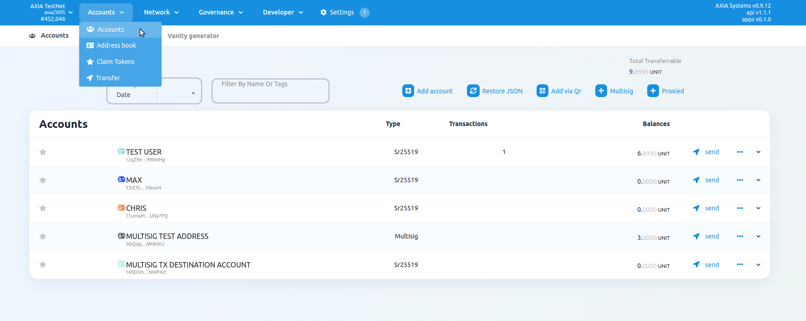
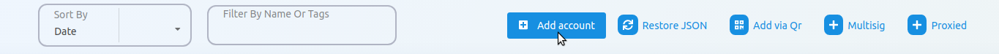
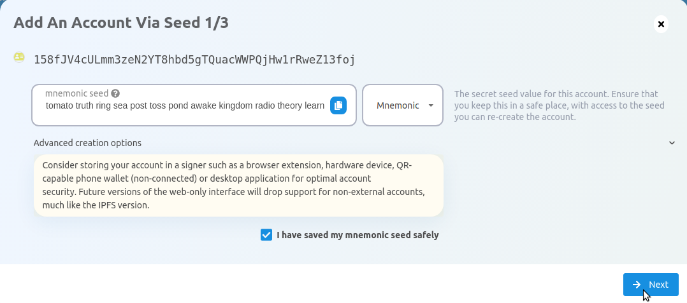
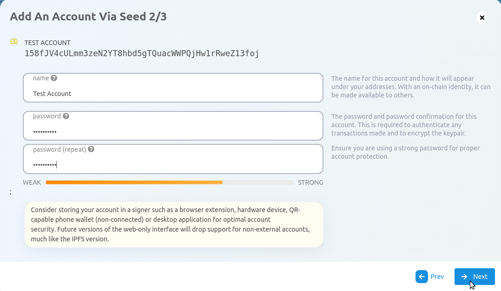
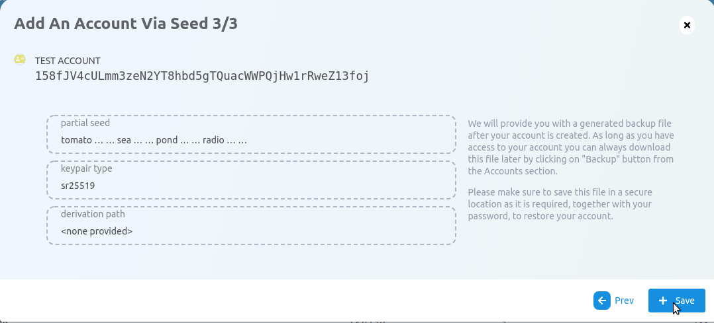
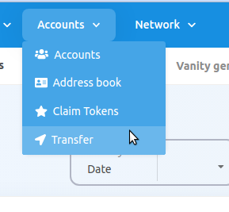
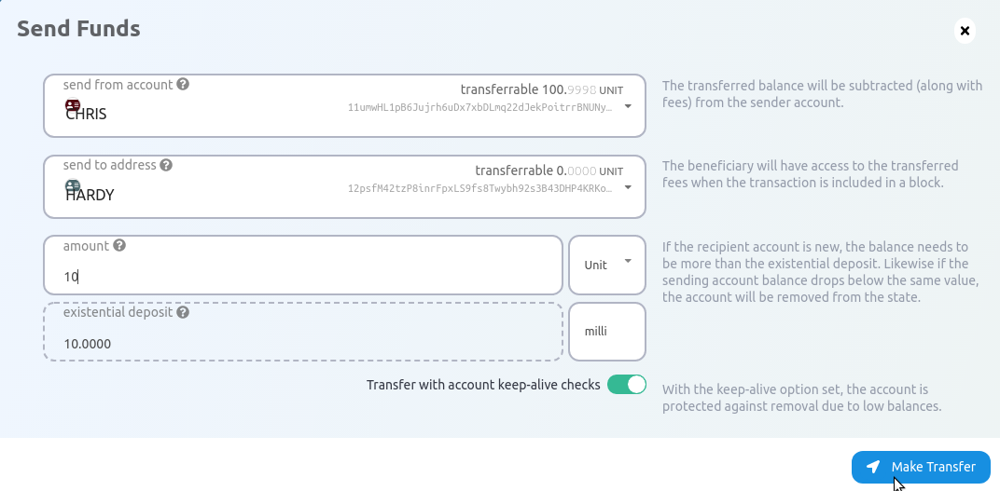
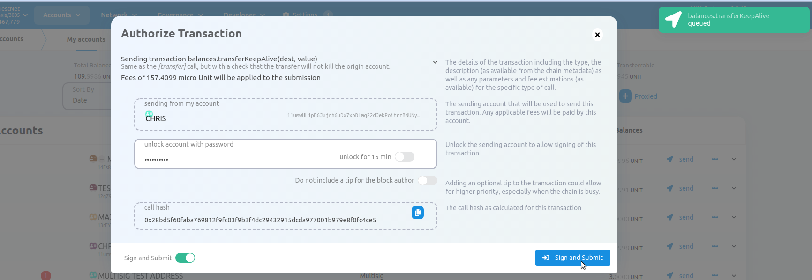
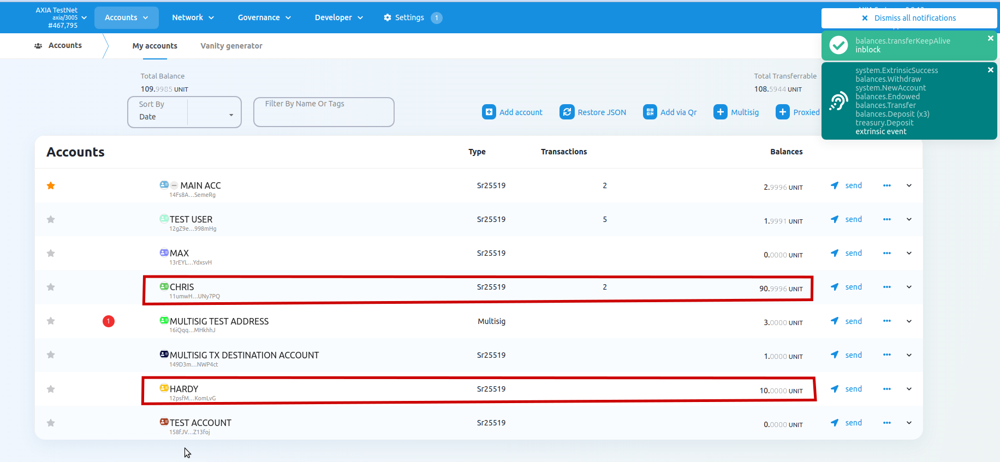

# Create Account

## **IMPORTANT:Key Security**
The only ways to get access to your account are via your secret seed or your account's JSON file in combination with a password. You must keep them both secure and private. If you share them with anyone they will have full access to your account, including all of your funds. This information is a target for hackers and others with bad intentions.

Please review this page carefully before making your account so that you understand the risks of the account generation method you choose and how to properly mitigate them in order to keep your funds safe.

### Storing your key safely​
The seed is your key to the account. Knowing the seed allows you, or anyone else who knows the seed, to re-generate and control this account.It is imperative to store the seed somewhere safe, secret, and secure. If you lose access to your account (i.e. you forget the password for your account's JSON file), you can re-create it by entering the seed. This also means that somebody else can have control over your account if they have access to your seed.

For maximum security, the seed should be written down on paper or another non-digital device and stored in a safe place. You may also want to protect your seed from physical damage, as well (e.g. by storing in a sealed plastic bag to prevent water damage, storing it in a fireproof safe, etching it in metal, etc.) It is recommended that you store multiple copies of the seed in geographically separate locations (e.g., one in your home safe and one in a safety deposit box at your bank).

You should **not store your seed on any kind of computer that has or may have access to the internet in the future**.

### Storing your account's JSON file
The JSON file is encrypted with a password, which means you can import it into any wallet which supports JSON imports, but to then use it, you need the password. You don't have to be as careful with your JSON file's storage as you would with your seed (i.e. it can be on a USB drive near you), but remember that in this case, your account is only as secure as the password you used to encrypt it. Do not use easy to guess or hard to remember passwords. It is good practice to use a mnemonic password of four to five words. These are nearly impossible for computers to guess due to the number of combinations possible, but much easier for humans to remember.

### Go to AXIA-JS Apps

Navigate to [AXIA-JS Apps](https://apps.test.axiacoin.network/?rpc=wss%3A%2F%2Fwss.test.axiacoin.network#/accounts) and click on "Accounts" underneath the
Accounts tab. It is located in the navigation bar at the top of your screen.

> To create an account on a different network than AXIA, you'll need to click on the network
> selection in the top left corner of the navigation menu. A pop-up sidebar will appear listing
> live, testing, and custom node to choose from. Do remember to hit the "Switch" button when you
> want to switch your network.

### Start Account Generation

Click on the "Add Account" button.

The explorer will then use system randomness to make a new seed for you and display it to you in the form of twelve words.

### Name Account​
The account name is arbitrary and for your use only. It is not stored on the blockchain and will not be visible to other users who look at your address via a block explorer. If you're juggling multiple accounts, it helps to make this as descriptive and detailed as needed.

### Enter Password​
The password will be used to encrypt this account's information. You will need to re-enter it when using the account for any kind of outgoing transaction or when using it to cryptographically sign a message.

Note that this password does NOT protect your seed phrase. If someone knows the twelve words in your mnemonic seed, they still have control over your account even if they do not know the password.

### Create and Back-Up Account

Click “Save” and your account will be created. It will also generate a
backup JSON file that you should safely store, ideally on a USB
off the computer you're using. You should not store it in cloud storage, email it to yourself, etc.

You can use this backup file to restore your account. This backup file is not readable unless it is
decrypted with the password.

Your account will be successfully created and added in the Accounts list.

# **Balance Transfers**
Balance transfers are used to send balance from one account to another account. To start transferring balances, we will begin by using [AXIA-JS Apps](https://apps.test.axiacoin.network/?rpc=wss%3A%2F%2Fwss.test.axiacoin.network#/accounts). This guide assumes that you've already created an account and have some funds that are ready to be transferred.
## AXIA-JS Apps

> NOTE: In this walkthrough we will be using the AXIA network.
> If you would like to switch to a different network, you can change it by clicking the top
> left navigation dropdown and selecting a different network.

Let's begin by opening [AXIA-JS Apps](https://apps.test.axiacoin.network/?rpc=wss%3A%2F%2Fwss.test.axiacoin.network#/accounts). There are two ways to make a balance transfer:

1. By using the "Transfer" tab in the "Accounts" dropdown (located on the top navigational menu).
2. Clicking the "send" button while in the "Accounts" page.

### Using the Transfer Tab

Click on the "Transfer" tab in the "Accounts" dropdown.

Now a modal window will appear on the page. The modal asks you to enter 3 inputs:

- "send from account": Your account with funds that you will send from.
- "send to address": The address of the account that will receive the funds.
- "amount": The amount of tokens you will transfer.

The "existential deposit" box shows you the **minimum amount of funds you must keep in the account
for it to remain active.**

After setting your inputs correctly, click the "Make Transfer" button and confirm. Once the transfer
is included in a block you will see a green notification in the top-right corner of your screen.

After that you have to give the password of your account to authorize the transaction. Then click on "Sign and Submit". Within few second the amount will be transferred from your account to another account.

