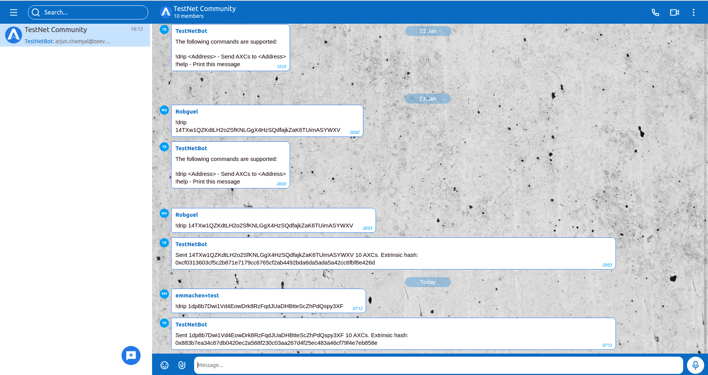

### Overview
AXchat bot/faucet is a Node.js app, which connects to AXchat server and listens for incoming messages in a specific group chat.

The bot listens for the 2 following commands:
```bash
- !drip <Address> - Send ${unit}s to <Address>
- !help - Print a help message`.
```
All other messages in all other chats including p2p are ignored.

In order to test the **!drip** command - a user needs to install the AXwallet app and get a wallet address. 

### Bot setup
 1. create an AXchat user/bot
 2. In AXchat - create a group Chat and add a bot user into it using standard ‘Add member’ feature.
 3. download node js app
 4. Provide .env file using the .env.example as a basis. Provide all the required credentials and settings.
 5. Run Node.js app

### Production Demo

Currently we have a working test/demo chat with the bot setup, where you can play with the bot.

