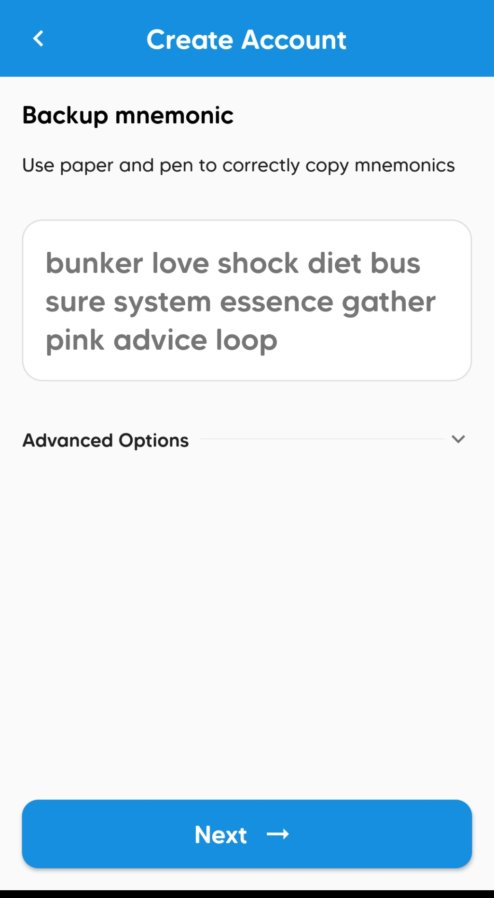
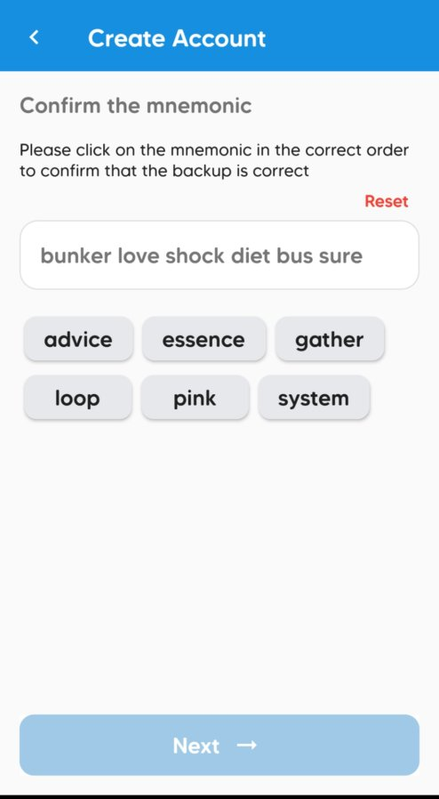

### AXIA Wallets
Wallet is a program that allows one to store private keys and sign transactions for AXIA or other blockchain networks. The integration of a wallet with AXIA allows for simple and easy access to private keys and signing transactions. Below are some wallets that support AXIA along with their development statuses.

### Supported Wallets
| Wallet Name                                                         | Development State | Description       |  Supports |
| ------------------------------------------------------------------- | -----------------| ----------------- |  -------- |
| [AXwallet](https://play.google.com/store/apps/details?id=com.axia.wallet) |Early Access              | iOS and Android   |  Staking  |
| [AXIA-js apps](https://apps.test.axiacoin.network/?rpc=wss%3A%2F%2Fwss.test.axiacoin.network#/accounts)         | Live                  | Browser           | Staking  |

### AXwallet

The AXwallet will be embedded in all applications in the AXIA Ecosystem.

The wallet is a free and secure tool that offers the ability to transact, exchange, buy, sell, hold, store, send and receive AXIA Coins. The wallet is also the means through which users of AXIA Coin receive unparalleled benefits and rewards just for participating.

Once a person registers for their AXwallet, those credentials can be conveniently used for every application in the AXIA Ecosystem. Once the profile is created, the wallet is generated. From there, participants will have access to each application. This profile can be synced across all their hardware devices such as a phone, computer or tablet.

AXIA is providing greater efficiency and more upside potential along with favorable rewards and benefits for all people who come into the ecosystem who have generated an AXwallet.

The AXwallet can also be used to empower people to develop income for themselves. An AXIA Ecosystem participant can easily utilize the AXwallet as a tool to generate additional earnings and rewards from their own followers, subscribers, users, attendees, services and products they offer depending on the application within the AXIA Ecosystem. They can leverage any of the apps to their advantage to pursue their own entrepreneurial goals just by maximizing the additional utility offered by having the AXwallet embedded in all the applications.

All activity taking place in the AXwallet within the AXIA Ecosystem can be settled instantaneously, and completed in a more cost-efficient manner than if conducted outside the AXIA Network. Moreover, there is the simultaneous added advantage that this activity will direct value back to strengthening AXIA Coin itself through the mechanism of coin burning leading to the reduction in Total Supply.

### How to create an account
After downloading AXwallet from the Google Play Store, it will show a interface like this:

Here you can see two options
* Create Account
* Import Account

### Create Account

In order to create a new account you can click on the `Create Account` button.

Then it will give some information about the application.

By pressing on the `Next` button it will generate a Twelve words Backup mnemonic.

On the next page you have to confirm the mnemonic and press `Next`. 

Now you have to give the Name and Password of the account. 

Your account will be added in the AXwallet application.

## Import Account

In order to Import an existing account click on the `Import Account` button.

In the next screen you can select Mnemonic as the Source Type and give the `Twelve words Mnemonic` or You can select Raw Seed as the Source Type and put the `Raw Seed` that you have already generated during your account generation.

You can also import your account by the Keystore(json) in this option you have to give the account Name and Password.

 After a few seconds it will import your existing account

### How to Transfer Balance
Click the top right icon of the application

Select a account which have some funds

Click the `AXC` under the Assets

It will show an interface like this. In the down below there are two options `Receive` and `Transfer`.

By clicking `Receive` it will show a QR code with the wallet address.

One can scan the QR code or copy this address to send the AXC.

With `Transfer` you can send some AXC to other accounts. 

By clicking the scan icon on the top right corner.

You can aslo scan the QR code of another account

Or you can give a address manually or select some existing address

Type some amount in the box and click on `Make Transfer`

You can see the Transaction details. Click `Submit` to make the transfer.

It will ask for Authentication like your fingerprint 

or you have to give the password of your account

It will take few seconds.

AXC's are deducted from your account and the AXC has successfully transferred from the account to the desired account.

You can go and check the change will be reflected.

