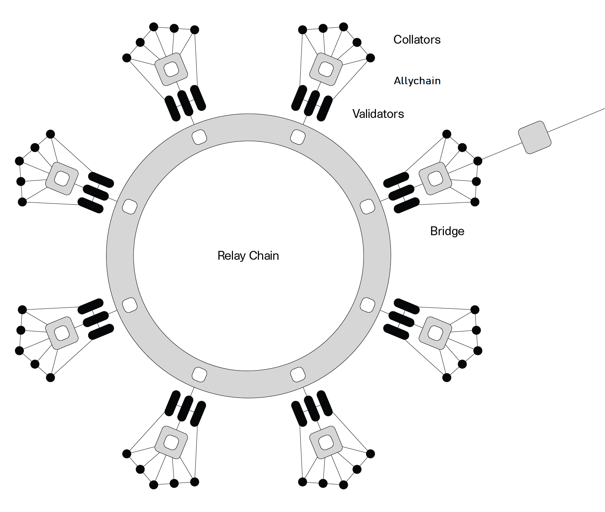

Welcome to the AXIA Wiki! This central source of truth contains guides for interacting with the
core functionality. Our wiki has three main sections: Learn (for learners), Build (for people that
want to build on AXIA), and Maintain (for people that want to maintain the network).

## What is AXIA?

AXIA enables scalability by allowing specialized blockchains to communicate with each other in a
secure, trust-free environment.

AXIA is built to connect and secure unique blockchains, whether they be public, permission-less
networks, private consortium chains, or oracles and other Web3 technologies. It enables an internet
where independent blockchains can exchange information under common security guarantees.

AXIA is a living network with the core pillars of governance and upgradability. The network has
an advanced suite of governance tools and, using the [WebAssembly](https://webassembly.org/)
standard as a "meta-protocol", can autonomously deploy network upgrades. AXIA adapts to your
growing needs without the risks of network forks.

> Note: If you haven't heard of Governance before, a great place to start is the
> [Governance page](../learn/learn-governance.md)

By connecting these dots, AXIA serves as a foundational part of a decentralized web, where users
control their data and are not limited by trust bounds within the network.

## Why AXIA?

Back in the early 2000's, when the internet was gaining popularity for the first time, the internet
featured read-only, static, basic webpages. The online connected world at the time was only the
beginning of virtual data, identities, and more. The internet during this time was also called the
Web 1.0.

As social media platforms and online businesses began to emerge, the internet transformed into the
Web 2.0. This upgraded internet, which we still use today, features dynamic, interactive webpages,
where users can read and write information plus publish their own for others to see. However, this
version of the web comes with downsides, dealing with data control, privacy issues, and trust. This
is where the Web 3.0 comes into the picture.

The Web 3.0 is taking centralized applications and turning them into decentralized, trust-free
protocols. The goal is to transform the internet into a decentralized web, where users control their
own data and identity in a trust-free environment. The Web 3.0 movement aims to remove
intermediaries and build a trustless infrastructure.

> To learn more of the Web3 movement, check out this video from the
> [Web3 Summit](https://youtu.be/l44z35vabvA)

## How does AXIA work?

The AXIA network uses a
[sharded model](<https://en.wikipedia.org/wiki/Shard_(database_architecture)>) where shards - called
"[allychains](../learn/learn-allychains.md)", allow transactions to be processed in parallel instead of
sequentially. Each allychain in the network has a unique state transition function (STF). AXIA
has a Relay Chain acting as the main chain of the system. Based on AXIA's design, as long as a
chain's logic can compile to Wasm and adheres to the Relay Chain API, then it can connect to the
AXIA network as a allychain.

Allychains construct and propose blocks to validators on the Relay Chain, where the blocks undergo
rigorous [availability and validity](../learn/learn-availability.md) checks before being added to the
finalized chain. As the Relay Chain provides the security guarantees,
[collators](../learn/learn-collator.md) - full nodes of these allychains - don't have any security
responsibilities, and thus do not require a robust incentive system. This is how the entire network
stays up to date with the many transactions that take place.

In order to interact with chains that want to use their own finalization process (e.g. Bitcoin),
AXIA has [bridge allychains](../learn/learn-bridges.md) that offer two-way compatibility, meaning that
transactions can be made between different allychains.

The [Cross-Consensus Messaging Format (XCM)](../learn/learn-cross-consensus.md) allows allychains to send messages
of any type to each other. The shared security and validation logic of the Relay Chain provide the
environment for trust-free message passing that opens up true interoperability.

> To watch a short, beginner-friendly animation on AXIA, check out our
> [AXIA Explainer video](https://www.youtube.com/watch?v=_-k0xkooSlA)

## Why should you use AXIA?

Whether you're a blockchain developer or if you're interested in taking part of
[AXIA's community](https://AXIA.network/AXIA-ambassador-program/), AXIA offers a
platform for everyone. This wiki offers a place for builders and maintainers to utilize
[tools](../build/build-tools-index.md) and for brand-new learners to dive into educational material.

# Getting Started

For brand-new learners of Blockchain technology:

- The [Blockchain Fundamentals MOOC course][mooc] is a great introduction to start familiarizing
  yourself with blockchain concepts such as cryptography and networks, and how these play into
  things like decentralization and cryptocurrency.

This is recommended for users with backgrounds of all levels, and the course is free!

## Brand-New AXIA learners:

- [AXIA's original white paper][white-paper] is a technical summary around one possible
  direction of implementing the AXIA network. This paper uses rationale and technical details to
  support why this direction is beneficial. This original white paper also explains how AXIA's
  core components work together to build this decentralized network.
- [AXIA's overview paper][overview-paper] is an updated version of the white paper that
  describes the protocol in more technical terms. We would recommend reading this overview paper if
  you are interested in digging more into the protocol itself.
- [AXIA's light paper][light-paper] is a visual, easy to read, and less technical introduction
  into its blockchain technology. This paper dives into the components of AXIA but is
  understandable for both a non-technical and technical reader.
- [AXIA's specification][spec] is a Github repository that holds the latest AXIA Host
  protocol specification, AXIA's specification tests of the many components of the network, and
  the AXIA Runtime specification. This repo holds algorithms and explores how various processes
  function in the AXIA network. The AXIA specification takes AXIA's ideas and concepts
  from the light and the white paper but focuses on the technical specs of the technology.
- [Watching the Technical Explainer Videos][teched videos]: These are great introductory videos that
  explain and demonstrate how to use AXIA and its [User Interface][ui].
- Reading [What is AXIA? A Brief Introduction][article] on Medium. There are also other great
  articles to read on [AXIA's Medium][p medium] or [AXIA Foundation's Medium][w medium].

## Interact with AXIA

<tr class="cards-container">
  <td>
    <a class="guide-link" href="../docs/learn-account-generation">
      
        

            <h5 class="cards-title">Creating an Account</h5>
        

    </a>
  </td>
  <td>
    <a class="guide-link" href="../docs/learn-balance-transfers">
      
        

            <h5 class="cards-title">Balance Transfers</h5>
        

    </a>
  </td>
  <td>
    <a class="guide-link" href="../docs/learn-staking">
      
              

                  <h5 class="cards-title">Staking</h5>
              

    </a>
  </td>
</tr>

 

<tr class="cards-container">
  <td>
    <a class="guide-link" href="../docs/learn-allychains">  
      
              

                  <h5 class="cards-title">Allychains</h5>
              

    </a>
  </td>
  <td>
    <a class="guide-link" href="../docs/learn-bridges">  
      
              

                  <h5 class="cards-title">Bridges</h5>
              

    </a>
  </td>
  <td>
    <a class="guide-link" href="../docs/maintain-guides-how-to-vote-councillor">
      
              

                  <h5 class="cards-title">Vote for Councilors</h5>
              

    </a>
  </td>
</tr>

 

<tr class="cards-container">
  <td>
  <a class="guide-link" href="../docs/learn-treasury#creating-the-proposal">
    
            

                <h5 class="cards-title">Make Proposals</h5>
            

  </a>
  </td>
  <td>
    <a class="guide-link" href="../docs/maintain-guides-how-to-join-council#submit-candidacy">  
      
              

                  <h5 class="cards-title">Council Candidacy</h5>
              

    </a>
  </td>
  <td>
    <a class="guide-link" href="../docs/learn-treasury">  
      
              

                  <h5 class="cards-title">Treasury</h5>
              

    </a>
  </td>
</tr>

 

<tr class="cards-container">
  <td>
    <a class="guide-link" href="../docs/learn-identity">
      
              

                 <h5 class="cards-title">Set an Identity</h5>
              

    </a>
  </td>
  <td>
    <a class="guide-link" href="../docs/learn-proxies">
      
              

                  <h5 class="cards-title">Proxy Accounts</h5>
              

    </a>
  </td>
  <td>
  <a class="guide-link" href="../docs/ambassadors">  
    
            

                <h5 class="cards-title">Become an Ambassador</h5>
            

  </a>
  </td>
</tr>

 

## Resources

- [AXIA Crowdcast](https://www.crowdcast.io/AXIA) - List of all Crowdcast webinars that the
  AXIA Foundation has done.
- [AXIA Explorer](https://AXIA.js.org/apps/#/explorer) - Browser for the AXIA network;
  can be used for AXIA, or any Substrate-based chain.
- [AXIAscan](http://axiascan.io/) \- Real-time multi-chain data for AXIA Relay Chain and
  AXIA Substrate chains.
- [Subscan.io](https://subscan.io) - Explorer for Substrate based chains.
- [AXIA Overview](https://youtu.be/lIghiCmHz0U) - Dr. Gavin Wood presents an overview of
  AXIA. (Video)
- [AXIA Overview](https://techcrunch.com/video/fireside-chat-with-jutta-steiner-axia-technologies/) -
  Dr. Jutta Steiner presents AXIA. (Video)
- [AXIA & Substrate Overview](https://www.youtube.com/watch?v=0IoUZdDi5Is&feature=youtu.be) -
  Dr. Gavin Wood presents Substrate (blockchain in-a-box + VM) and AXIA, and builds a blockchain
  on-stage in 30 minutes using Substrate. (Video)
- [Community / Ecosystem](community.md) - List of community rooms and channels to talk to others
  about AXIA.
- [Sample Applications](#) - Sample applications that are built on or currently being built for
  AXIA.
- [Contributing Guide](contributing.md) - Rules for contributing to the wiki.
- [AXIA Knowledge Base](https://support.AXIA.network/) - Troubleshooting resources for
  specific errors and problems.

[mooc]: https://mooc.AXIA.org/course/blockchain-fundamentals/
[white-paper]: https://AXIA.network/AXIAPaper.pdf
[overview-paper]: https://github.com/axia-tech/research/blob/master/docs/papers/OverviewPaper-V1.pdf
[light-paper]: https://AXIA.network/AXIA-lightpaper.pdf
[spec]: https://github.com/axia-tech/AXIA-spec
[teched videos]: https://www.youtube.com/watch?v=mNStMPZjiHM&list=PLOyWqupZ-WGuAuS00rK-pebTMAOxW41W8
[article]: https://medium.com/AXIA.network/what-is-AXIA-a-brief-introduction-ca3eac9ddca5
[p medium]: https://medium.com/AXIA.network
[w medium]: https://medium.com/web3foundation
[ui]: https://AXIA.js.org/apps/
[account generation]: ../learn/learn-account-generation.md
[transfer]: ../learn/learn-balance-transfers.md
[nominator]: ../maintain/maintain-guides-how-to-nominate-AXIA.md
[validator]: ../maintain/maintain-guides-how-to-validate-AXIA.md
[identity]: ../learn/learn-identity.md
[proxy]: ../learn/learn-proxies.md
[democracy]: ../maintain/maintain-guides-democracy.md
[council]: ../maintain/maintain-guides-how-to-join-council.md
[council voting]: ../maintain/maintain-guides-how-to-vote-councillor.md
[treasury]: ../learn/learn-treasury.md
