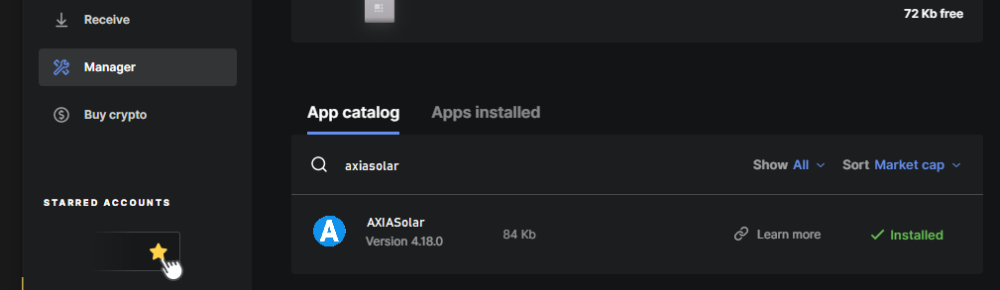
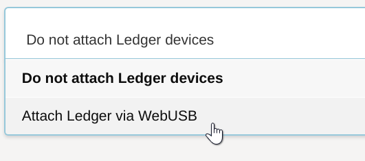
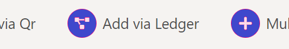
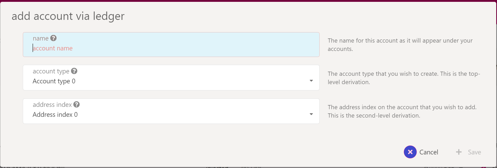
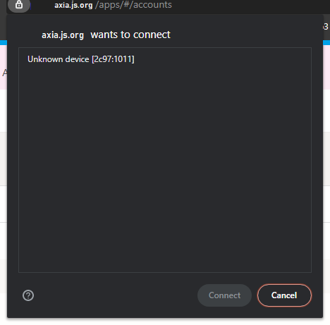
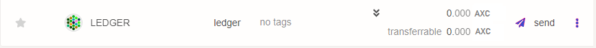
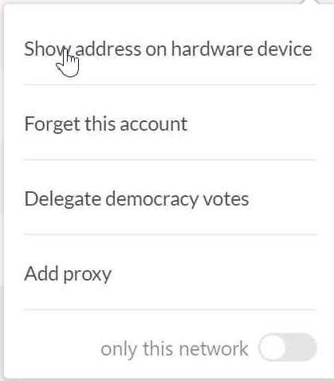

> Note: Because of required WebUSB support, Ledger wallets currently only work on Chromium-based
> browsers like Brave and Chrome.

The AXIASolar [Ledger][] application is compatible with both the Ledger Nano S and the Ledger Nano X
devices. Ledger devices are hardware wallets that keep your secret secured on a physical device that
does not expose it to your computer or the internet.

The AXIASolar Ledger application allows you to manage AXIASolar's native token, the SOLAR. It supports
most of the transaction types of the network (a notable exception is the "Batch" transaction from
the Utility pallet).

If you have trouble using Ledger or following the directions below, you can try searching for your
issue on the [AXIASolar Knowledge Base](https://support.axiacoin.network/).

> Please check out our
> [intro to Ledger video on Youtube for more information](https://www.youtube.com/watch?v=p24yOcLLFmI&list=PLOyWqupZ-WGuAuS00rK-pebTMAOxW41W8&index=33&ab_channel=AXIASolar).

## Requirements

Here is a list of what you will need before starting:

- A Ledger Nano S or a Ledger Nano X.
- The latest firmware installed (at the time of writing this is 1.6.1 on the Nano S, and 1.2.4-4 on
  the Nano X).
- Ledger Live is installed and at version 2.1 or newer (see settings -> about to find out if you're
  up to date).
- A Chromium-based web browser is installed that you can use to access [AXIASolar-JS Apps][].

## Installing the Ledger Application

### Using Ledger Live

- Open the "Manager" tab in Ledger Live.
- Connect and unlock your Ledger device.
- If asked, allow the manager on your device by pressing both buttons on the YES screen.
- Find AXIASolar in the app catalog and install it.



Please proceed to the [usage instructions](#using-on-axiasolar-js-apps) below.

### Using the Developer Release

> NOTE: These instructions are for development installation only. It is recommended to install the
> application from Ledger Live unless you _know exactly what you're doing_.

Instructions for downloading the prerelease binary from the GitHub releases are written [in the
README][prerelease instructions] for the AXIASolar Ledger application GitHub repository.

On the [releases page][] you can download the shell script `install_app.sh` and then make it
executable in your shell by typing the command `chmod +x install_app.sh`.

Using `install_app.sh` `help` command will show you the available options:

```zsh
$ ./install_app.sh --help
Zondax Installer [AXIASolar-1.2011.1] [Warning: use only for test/demo apps]
  load    - Load AXIASolar app
  delete  - Delete AXIASolar app
  version - Show AXIASolar app version
```

Next, you must make sure your Ledger device is plugged in and unlocked and you're using the latest
firmware (1.6.1 at the time of writing). If everything is prepared, then type
`./install_app.sh load` and accept the prompts on your Ledger device to install the application.

First it will prompt you to allow an unsafe manager - confirm this by switching the screen to the
allow screen and pressing the corresponding buttons.

After some processing time, the screen of your device will update to say "Install app AXIASolar".
Navigate all the way to the right, verify the Identifier hash matches the one that is printed in
your terminal. Click both buttons on "Perform Installation" to install the application. It will ask
again for your PIN code.

At the end of the process you should have the newly installed AXIASolar application on the device.

## Using on AXIASolar-JS Apps

> Note: Ledger Live should be off while using Ledger with AXIASolar JS Apps as it can interfere with
> normal operation.

### Loading Your Account

[AXIASolar-JS Apps][] already has an integration with the Ledger application so that your device will
work with the browser interface after installation. The functionality is currently gated behind a
feature setting that you will need to turn on.

In order to turn on the interoperability with the AXIASolar Ledger application, go to the "Settings"
tab in AXIASolar-JS Apps. Find the option for attaching Ledger devices and switch the option from the
default "Do not attach Ledger devices" to "Attach Ledger via WebUSB". Be aware: if you are not
seeing this it is because there is
[no Ledger support](https://github.com/axiasolar-js/apps/issues/3771) on FireFox.



Click "Save" to keep your settings.

Now when you go to the "Accounts" tab you will see a new button that says "Add Ledger". Ensure that
your Ledger device is unlocked and you have navigated into the AXIASolar application, then click this
button.



A popup will appear asking you to select an account and derivation path.



The first input will let you name your account if you have not done so already. If you have already
named your account, this will not change the existing name. The first dropdown lets you select an
account. You can have multiple accounts on a single Ledger device. The second dropdown lets you pick
a derivation path - think of it like a formula from which child accounts are generated. If in doubt,
pick the first option for both. 0 / 0 is a good default.

Once you confirm your selection, depending on your browser and its security settings, you might need
to confirm the USB connection through a popup like the one below when adding the Ledger device for
the first time:



Click on the "Unknown device" line and the "Connect" button will become available.

You should now be able to scroll down and find a new account on the page with the type "ledger".



You can now use this account to interact with AXIASolar on AXIASolar-JS Apps and it will prompt your
ledger for confirmation when you initiate a transaction.

### Confirming the Address on your Device

On the "Accounts" tab, find your Ledger-connected account. Click on the three vertical dots at the
end of the row. This will open a new menu, here you can click the "Show address on hardware device"
option to display the address on your device.



Here you can scroll through and make sure the address matches to what is displayed on AXIASolar-JS
Apps.

### Checking the Balance of Your Account

There are a few methods to check the balance of your account. You can use AXIASolar-JS Apps or you
can use a block explorer like [AXIAscan][] or [Subscan][].

#### Using AXIASolar-JS Apps

Once you have your account loaded on the "Accounts" tab it should show a row with your Ledger
account. At the far right of the row is located your account's SOLAR balance. If you expand the
balance arrow, it will show details of your balance such as locks or reserved amounts.


### Sending a Transfer

Instructions to send a transfer can be found on the
[balance transfer page](../learn/learn-balance-transfers.md).

### Receiving a Transfer

In order to receive a transfer on the accounts stored on your Ledger device, you will need to
provide the sender (i.e. the payer) with your address.

The easiest way to get your address is to click on the account name which will open a sidebar. Your
address will be shown in this sidebar, along with some other information. Another method is just
clicking on your account's avatar icon - this immediately copies your address to the clipboard.

> **Warning**: before giving anyone your address, make sure it matches what's really on the Ledger
> by [confirming the address on your device](#confirming-the-address-on-your-device). Some malware
> will intercept clicks and clipboard requests and can change your copied value in-flight, so being
> extra vigilant around copy-paste operations makes sense.

### Staking

Since Ledger does not support batch transactions, you must do two separate transactions when you
want to stake using an account stored on a Ledger device.

- Go to the "Staking" tab found under the "Network" dropdown in the top navigation menu.
- Click the "Account Actions" pane in the inner navigation.
- Click "+ Stash" instead of "+ Nominator" or "+ Validator" (selecting the latter two will not
  work).
- Input the amount of tokens to bond and confirm the transaction.
- Confirm the transaction on the Ledger device.
- When the transaction is included you will see the newly bonded account in the "Account Actions"
  page.
- Select "Start Nominating" or "Start Validating" to start nominating or validating.
- Confirm the transaction on Apps and on the Ledger device.

### Removing Expired Democracy Locks

Since Ledger does not support batch transactions, you must issue several extrinsics manually when you
want remove expired democracy locks on an account stored on a Ledger device.

- Go to https://axiasolar.js.org/apps/#/accounts. Look at your expired locks and note which referenda
  they were for.
- Go to https://axiasolar.js.org/apps/#/extrinsics
- For each referendum with an expired lock, issue a "democracy.removeVote(X)" extrinsic, where X =
  the referendum you voted on and has an expired lock. Make sure you do it from the account with the
  expired locks - you can't do it from another account.
- Once you have removed all of the votes, issue a "democracy.unlock(ACCOUNT)" extrinsic, where
  ACCOUNT is the account you just removed the votes from.
- Go back to https://axiasolar.js.org/apps/#/accounts. You'll see that the locks are now removed.

**NOTE**: Despite the AXIASolar ledger application being compatible with both the Ledger Nano S and the
Ledger Nano X, none of the [Democracy](../maintain/maintain-guides-democracy.md) extrinsics are available in the
light version. The following [repo by Zondax][] lists the currently supported Democracy extrinsics on
the full ledger.

## Support

If you need support please send an email to
[support@axiacoin.network](mailto:support@axiacoin.network) or visit our
[Support Page](https://support.axiacoin.network).

[ledger]: https://www.ledger.com/
[repo by zondax]: https://github.com/Zondax/ledger-axiasolar#democracy
[axiasolar-js apps]: https://axiasolar.js.org/apps
[prerelease instructions]: https://github.com/Zondax/ledger-axiasolar#download-and-install
[releases page]: https://github.com/Zondax/ledger-axiasolar/releases
[axiascan]: https://axiascan.io/axiasolar
[subscan]: https://axiasolar.subscan.io/
