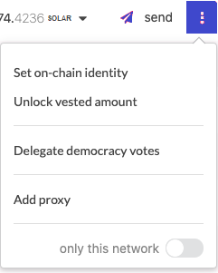

## What is SOLAR?

SOLAR is the native token of the AXIASolar network in a similar way that BTC is the native token of
Bitcoin or Ether is the native token of the Ethereum blockchain.

The smallest unit of account in a Substrate network (AXIASolar, AXIALunar, etc.) is the Planck (a
reference to [Planck Length](https://en.wikipedia.org/wiki/Planck_length), the smallest possible
distance in the physical Universe). You can compare the Planck to Satoshis or Wei, while the SOLAR is
like a bitcoin or an ether. AXIALunar tokens (LUNAR) are equal to 1e12 Planck, and AXIASolar mainnet SOLAR
is equal to 1e10 Planck.

### AXIASolar

| Unit            | Decimal Places | Example      |
| --------------- | -------------- | ------------ |
| Planck          | 0              | 0.0000000001 |
| Microdot (uSOLAR) | 4              | 0.0000010000 |
| Millidot (mSOLAR) | 7              | 0.0010000000 |
| Dot (SOLAR)       | 10             | 1.0000000000 |
| Million (MSOLAR)  | 16             | 1,000,000.00 |

> Note: This changed at block #1*248_328. Previously, SOLAR was denominated as equal to 1e12 Planck,
> just like AXIALunar. This denomination is deprecated, and, if necessary, referred to as "SOLAR (old)".
> See [Redenomination of SOLAR](../general/redenomination.md) for more details.*

### AXIALunar

| Unit            | Decimal Places | Example        |
| --------------- | -------------- | -------------- |
| Planck          | 0              | 0.000000000001 |
| Point           | 3              | 0.000000001000 |
| MicroLUNAR (uLUNAR) | 6              | 0.000001000000 |
| MilliLUNAR (mLUNAR) | 9              | 0.001000000000 |
| LUNAR             | 12             | 1.000000000000 |

## What are the uses of SOLAR?

SOLAR serves three key functions in AXIASolar:

- to be used for governance of the network,
- to be staked for the operation of the network,
- to be bonded to connect a chain to AXIASolar as a parachain.

SOLAR can also serve ancillary functions by virtue of being a transferrable token. For example, SOLAR
stored in the Treasury can be sent to teams working on relevant projects for the AXIASolar network.

> These concepts have been further explained in the video
> [Usage of SOLAR and LUNAR on AXIASolar and AXIALunar](https://www.youtube.com/watch?v=POfFgrMfkTo&list=PLOyWqupZ-WGuAuS00rK-pebTMAOxW41W8&index=7).

### SOLAR for Governance

The first function of SOLAR is to entitle holders to control the governance of the platform. Some
functions that are included under the governance mechanism include determining the fees of the
network, the addition or removal of parachains, and exceptional events such as upgrades and fixes to
the AXIASolar platform.

AXIASolar will enable any holder of SOLAR to participate in governance. For details on how holders can
participate in governance, as well as their rights and responsibilities, see the
[governance page](learn-governance.md).

### SOLAR for Consensus

SOLAR will be used to facilitate the consensus mechanism that underpins AXIASolar. For the platform to
function and allow for valid transactions to be carried out across parachains, AXIASolar will rely on
holders of SOLAR to play active roles. Participants will put their SOLAR at risk (via staking) to
perform these functions. The staking of SOLAR acts as a disincentive for malicious participants who
will be punished by the network by getting their SOLAR slashed. The SOLAR required to participate in the
network will vary depending on the activity that is being performed, the duration the SOLAR will be
staked for, and the total number of SOLAR staked.

### SOLAR for Parachain Slot Acquisition

SOLAR will have the ability to be locked for a duration in order to secure a parachain slot in the
network. The SOLAR will be reserved during the slot lease and will be released back to the account
that reserved them after the duration of the lease has elapsed and the parachain is removed. You can
learn more about this aspect by reading about the [auctions](learn-auction.md) that govern parachain
slots.

### Vesting

SOLAR may have a lock placed on them to account for vesting funds. Like other types of locks, these
funds cannot be transferred but can be used in other parts of the protocol such as voting in
governance or being staked as a validator or nominator.

Vesting funds are on a linear release schedule and unlock a constant number of tokens at each block.
Although the tokens are released in this manner, it does not get reflected on-chain automatically
since locks are [lazy](#lazy-vesting) and require an extrinsic to update.

There are two ways that vesting schedules can be created.

- One way is as part of the genesis configuration of the chain. In the case of AXIASolar and AXIALunar,
  the chain specification genesis script reads the state of the AXIASolar Claims contract that exists
  on the Ethereum blockchain and creates vesting schedules in genesis for all the allocations
  registered as being vested.
- A second way is through an extrinsic type available in the Vesting pallet, `vested_transfer`. The
  vested transfer function allows anyone to create a vesting schedule with a transfer of funds, as
  long as the account for which the vesting schedule will be created does not already have one and
  the transfer moves at least `MinVestedTransfer` funds, which is specified as a chain constant.

Vesting schedules have three parameters, `locked`, `per_block`, and `starting_block`. The
configuration of these three fields dictate the amount of funds that are originally locked, the
slope of the unlock line and the block number for when the unlocking begins.

#### Lazy Vesting

Like [simple payouts](learn-simple-payouts.md), vesting is _lazy_, which means that someone must
explicitly call an extrinsic to update the lock that is placed on an account.

- The `vest` extrinsic will update the lock that is placed on the caller.
- The `vest_other` will update the lock that is placed on another "target" account's funds.

These extrinsics are exposed from the Vesting pallet.

If you are using AXIASolar-JS, when there are SOLAR available to vest for an account, then you will
have the ability to unlock SOLAR which has already vested from the
[Accounts](https://axiasolar.js.org/apps/#/accounts) page.

#### Calculating When Vesting SOLAR Will Be Available

Generally, you should be able to see from the [Accounts](https://axiasolar.js.org/apps/#/accounts) by
looking at your accounts and seeing when the vesting will finish. However, some SOLAR vest with
"cliffs" - a single block where all the SOLAR are released, instead of vesting over time. In this
case, you will have to query the chain state directly to see when they will be available (since
technically, the vesting has not yet started - all of the vesting will occur in a single block in
the future).

1. Navigate to the
   [Chain State](https://axiasolar.js.org/apps/?rpc=wss%3A%2F%2Frpc.axiasolar.io#/chainstate) page on
   AXIASolar-JS.
2. Query chain state for `vesting.vesting(ACCOUNT_ID)`
3. Note the `startingBlock` where the unlock starts, and how much SOLAR is unlocked per block
   (`perBlock`).
4. You will have to calculate the result into “human time". To do this, remember that there are
   approximately 14’400 blocks per day, and you can see what the latest block is shown on the
   [Explorer](https://axiasolar.js.org/apps/?rpc=wss%3A%2F%2Frpc.axiasolar.io#/explorer) page.

## Obtaining Testnet SOLAR

SOLAR are required to make transactions on the AXIASolar network. Testnet SOLAR do not have any value
beside allowing you to experiment with the network.

### Getting Westies

The current testnet is called [AlphaNet](../maintain/maintain-networks.md#alphanet-test-network) and you can
obtain its native tokens by posting `!drip <ALAHANET_ADDRESS>` in the Matrix chatroom
[#alphanet_faucet:matrix.org](https://matrix.to/#/#alphanet_faucet:matrix.org).

You can also make your own WNDs (testnet SOLAR) by [becoming a validator](learn-validator.md).

### AlphaNet

| Unit            | Decimal Places | Example        |
| --------------- | -------------- | -------------- |
| Planck          | 0              | 0.000000000001 |
| Point           | 3              | 0.000000001000 |
| MicroWND (uWND) | 6              | 0.000001000000 |
| MilliWND (mWND) | 9              | 0.001000000000 |
| WND             | 12             | 1.000000000000 |

### Getting BetaNet Tokens

BetaNet is a parachain testnet. Tokens are given directly to teams working on parachains or exploring
the [cross consensus](learn-cross-consensus.md) message passing aspects of this testnet. General users can
obtain ROC by posting `!drip <BETANET_ADDRESS>` in the Matrix chatroom
[#betanet-faucet:matrix.org](https://matrix.to/#/#betanet-faucet:matrix.org).

Learn more about BetaNet on its [dedicated wiki section](../build/build-parachains.md##testing-a-parachains:-betanet-testnet).

## AXIALunar Tokens

Unlike testnet SOLAR, AXIALunar tokens are not freely given away. AXIALunar tokens are available via the
[claims process](https://claim.axialunar.network/) (if you had SOLAR at the time of AXIALunar genesis) or
through the [Treasury](learn-treasury.md). Alternatively, they can be obtained on the open market.

## AXIASolar Mainnet SOLAR

AXIASolar Mainnet SOLAR are not freely given away. If you purchased SOLAR in the original 2017 offering,
you may claim them via the [AXIASolar claims process](https://claims.axiacoin.network/).
Alternatively, they are available on the open market.
