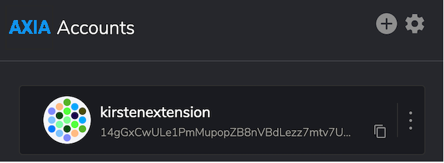
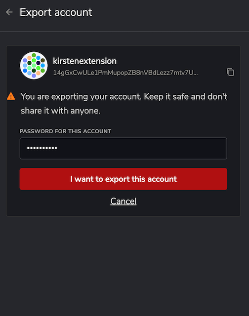
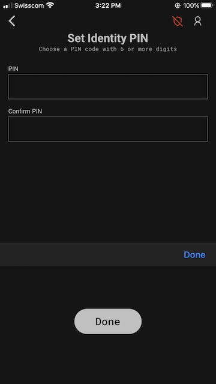

Depending on what software you are using to access your account, there are various ways to back up
and restore your account. It is a good idea to back your information up and keep it in a secure
place.. Note that in order to recover an account, you should create your account according to the
instructions [here](learn-account-generation.md). In general, however, as long as you know how you
created your account, and have the seed phrase (mnemonic phrase) or JSON file (and password) stored
securely, you will be able to restore your account.

This page covers backing up and restoring accounts in AXIACoin{.js} Browser Plugin, AXIACoin-JS UI,
and AXIA Signer. For other wallet applications, please see their specific documentation.

## AXIACoin{.js} Browser Plugin

To back up an account using the AXIACoin{.js} browser plugin, open the extension and select the
desired account to back up. Click on the three dots beside the address to open up the account
options menu.

Click on the Export Account button, which will then ask you for the password for that specific
account. Once you enter the correct password, the browser will automatically download a `.json` file
that will hold all the account restoration details that will be used when you restore your account.
You should store this file securely. Note that you will need the password for this account to
restore it.

To restore the account from this JSON file, once again open the AXIACoin{.js} browser plugin. Click
on the + button at the top. This will open up a menu wih several choices - select "Restore account
from backup JSON file". The program then prompts you for the `.json` file which was download earlier
and the password for that account.

Once these are filled out, and the "Restore" button has been pressed, you'll be taken back to the
main page of the plugin. This account will now be listed with the rest of your accounts.

## AXIACoin-JS

If you're using the main AXIACoin-JS UI, restoring an account will feel similar to restoring an
account on AXIACoin-JS browser plugin. Navigate to the
[Accounts page](https://axiasolar.js.org/apps/#/accounts) of AXIACoin-JS.

Click on the "Restore JSON" button, which will let you upload your `.json` file that you downloaded
and enter your password for that account. This `.json` file holds all relevant data about the
account to be used in account restoration. Note that you will need to enter your password here; the
file cannot be unencrypted without it.

After you press the "Restore" button, you should see a green notification letting you know that your
account has been restored. It will now be included in your accounts list on this browser.

### Using an Existing Mnemonic Seed to Restore an Account

You can also always restore an account by using the mnemonic phrase (seed words).

To do this with AXIACoin-JS, navigate to the
[AXIACoin-JS Accounts Page](https://axiasolar.js.org/apps/#/accounts). Click on the "Add Account"
button, and enter a name and password for the account. The name and the password of this added
account can be set to whatever you'd like, it does not need to be the same name and password as when
this account was initially created.

After this, delete the generated mnemonic phrase (seed words) and replace them with your _existing
seed words_. When you replace the generated mnemonic seed with your existing one, you are not
creating a new account, rather adding that account onto the AXIACoin-JS UI. Any account using the
same seed words will have control over that account on-chain. This is why it is so important to keep
your seed words secret and safe.

Finally, click the "Save" button, then click the "Create and backup account" button. This will
download the `.json` file which contains the data to be used in account restoration. You can use
this JSON file to restore this account in the future using the instructions above, or simply delete
the file and continue to use the mnemonic phrase to restore the account if necessary.

## AXIA Signer

If you've created an account with AXIA Signer, you can recover that account with your seed words.
If you generated the account with another wallet, there may be additional steps necessary, including
setting the derivation path: see
[this document](https://github.com/axia-tech/axia-signer/blob/master/docs/tutorials/Recover-Account-AXIACoinjs.md)
for details.

On AXIA Signer, click on the top-right user icon on the screen. Proceed to "+ Add Identity". On
this screen, tap on the "recover existing identity" button.

Enter in the identity name and the mnemonic seed phrase from the account you'd like to restore.

Set an identity PIN that will be used to unlock this account when you need to.

The identity has now been recovered and you can select a network to create the first account.
