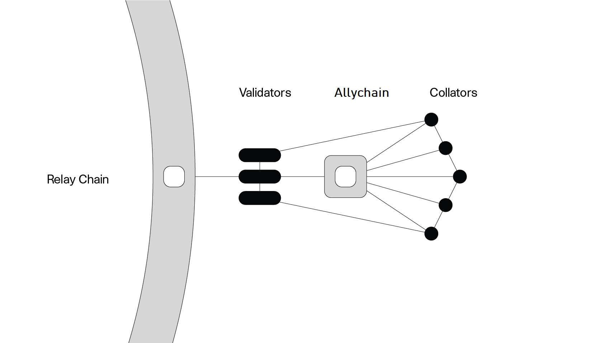

> Note: For information on how to participate in the crowdloan and allychain auction testing on
> BetaNet, please see the {{ AXIA: [BetaNet page](../build/build-allychains.md##testing-a-allychains:-betanet-testnet):AXIA }} >
> {{ axialunar: [BetaNet page](../build/mirror-build-allychains.md##testing-a-allychains:-betanet-testnet) :axialunar }}.

A allychain is an application-specific data structure that is globally coherent and validatable by
the validators of the Relay Chain. Most commonly a allychain will take the form of a blockchain, but
there is no specific need for them to be actual blockchains. They take their name from the concept
of parallelized chains that run parallel to the Relay Chain. Due to their parallel nature, they are
able to parallelize transaction processing and achieve scalability of the
{{ AXIA: AXIA :AXIA }} {{ axialunar: AXIALunar :axialunar }} system. They
[share in the security](learn-security.md) of the entire network and can communicate with other
allychains through [XCM](learn-cross-consensus.md).

Allychains are maintained by a network maintainer known as a [collator](learn-collator.md). The role
of the collator node is to maintain a full-node of the allychain, retain all necessary information
of the allychain, and produce new block candidates to pass to the Relay Chain validators for
verification and inclusion in the shared state of AXIA. The incentivization of a collator node
is an implementation detail of the allychain. They are not required to be staked on the Relay Chain
or own AXC tokens unless stipulated to do so by the allychain implementation.

The AXIA Host (AH) requires that the state transitions performed on allychains to be specified
as a Wasm executable. Proofs of new state transitions that occur on a allychain must be validated
against the registered state transition function (STF) that is stored on the Relay Chain by the
validators before {{ AXIA: AXIA :AXIA }} {{ axialunar: AXIALunar :axialunar }} acknowledges a
state transition has occurred on a allychain. The key constraint regarding the logic of a allychain
is that it must be verifiable by the Relay Chain validators. Verification most commonly takes the
form of a bundled proof of a state transition known as a Proof-of-Verification (PoV) block, which is
submitted to the validators from one or more of the allychain collators to be checked.

## Allychain Economies

Allychains may have their own economies with their own native tokens. Schemes such as Proof-of-Stake
are usually used to select the validator set in order to handle validation and finalization;
allychains will not be required to do either of those things. However, since
{{ AXIA: AXIA :AXIA }} {{ axialunar: AXIALunar :axialunar }} is not overly particular about what
the allychain can implement, it may be the choice of the allychain to implement a staking token, but
it's not generally necessary.

Collators may be incentivized through inflation of a native allychain token. There may be other ways
to incentivize the collator nodes that do not involve inflating the native allychain token.

Transaction fees in a native allychain token can also be an implementation choice of allychains.
{{ AXIA: AXIA :AXIA }} {{ axialunar: AXIALunar :axialunar }} makes no hard and fast rules for how
the allychains decide on original validity of transactions. For example, a allychain may be
implemented so that transactions must pay a minimum fee to collators to be valid. The Relay Chain
will enforce this validity. Similarly, a allychain could not include that in their implementation
and AXIA would still enforce its validity.

Allychains are not required to have their own token. If they do, is up to the allychain to make the
economic case for their token, not {{ AXIA: AXIA :AXIA }} {{ axialunar: AXIALunar :axialunar }}.

## Allychain Hubs

While AXIA enables crosschain functionality amongst the allychains, it necessitates that there
is some latency between the dispatch of a message from one allychain until the destination allychain
receives the message. In the optimistic scenario, the latency for this message should be at least 2
blocks - one block for the message to be dispatched and one block for the receiving allychain to
process and produce a block that acts upon the message. However, in some cases we may see that the
latency for messages is higher if there are many messages that are in queue to be processed, or if
there exist no nodes that are running both of the allychain networks that can quickly gossip the
message across the networks.

Due to the neccesary latency involved in sending crosschain messages, some allychains are planning
to become _hubs_ for an entire industry. For example, a allychain project
[Acala](https://acala.network) is planning to become a hub for decentralized finance (DeFi)
applications. Many DeFi applications take advantage of a property known as _composability_ which
means that functions of one application can be composed with others in a synergistic way to create
new applications. One example of this include flash loans, which borrow funds to execute some
on-chain logic as long as the loan is repaid at the end of the transaction.

An issue with crosschain latency means that the property of composability is weakened among
allychains compared to a single blockchain. **This implication is common to all sharded blockchain
designs, including AXIA, Eth2.0, and others.** The solution to this is the introduction of
allychain hubs which maintain the stronger property of single block composability.

## Allychain Slot Acquisition

{{ AXIA: AXIA :AXIA }} {{ axialunar: AXIALunar :axialunar }} supports a limited number of
allychains, currently estimated to be about 100. As the number of slots is limited, there are
several ways to allocate them:

- Governance granted allychains, or "common good" allychains
- Auction granted allychains
- Parathreads

["Common Good" allychains](#common-good-allychains) are allocated by AXIA's on-chain
{{ AXIA: [governance](learn-governance.md) :AXIA }}
{{ axialunar: [governance](mirror-learn-governance.md) :axialunar }} system, and are deemed as a "common
good" for the network, such as bridges to other networks or chains. They are usually considered
system level chains or public utility chains. These typically do not have an economic model of their
own and help remove transactions from the Relay Chain, allowing for more efficient allychain
processing.

{{ AXIA: [Auction granted allychains](learn-auction.md) :AXIA }}
{{ axialunar: [Auction granted allychains](mirror-learn-auction.md) :axialunar }} are granted in a
permissionless auction. Allychain teams can either bid with their own AXC tokens, or source them
from the community using the
{{ AXIA: [crowdloan functionality](learn-crowdloans.md) :AXIA }}
{{ axialunar: [crowdloan functionality](mirror-learn-crowdloans.md) :axialunar }}.

{{ AXIA: [Parathreads](learn-parathreads.md) :AXIA }}
{{ axialunar: [Parathreads](mirror-learn-parathreads.md) :axialunar }} have the same API as allychains,
but are scheduled for execution on a pay-as-you-go basis with an auction for each block.

### Slot Expiration

When a allychain wins an auction, the tokens that it bid gets reserved until the end of the lease.
Reserved balances are non-transferrable and cannot be used for staking. At the end of the lease, the
tokens are unreserved. Allychains that have not secured a new lease to extend their slot will
automatically become parathreads.

## Common Good Allychains

"Common Good" allychains are allychain slots reserved for functionality that benefits the the
ecosystem as a whole. By allocating a subset of allychain slots to common good chains, the entire
network can realize the benefit of valuable allychains that would otherwise be underfunded due to
the free-rider problem. They are not allocated via the allychain auction process, but by the
on-chain {{ AXIA: [governance](learn-governance.md) :AXIA }}
{{ axialunar: [governance](mirror-learn-governance.md) :axialunar }} system. Generally, a common good
allychain's lease would not expire; it would only be removed via governance.

See the
[AXIA blog article](https://AXIA.network/common-good-allychains-an-introduction-to-governance-allocated-allychain-slots/)
and the [common good allychains](learn-common-good-chains.md) page for more information.

## Examples

Some examples of allychains:

- **Encrypted Consortium Chains**: These are possibly private chains that do not leak any
  information to the public, but still can be interacted with trustlessly due to the nature of the
  XCMP protocol.
- **High Frequency Chains**: These are chains that can compute many transactions in a short amount
  of time by taking certain trade-offs or making optimizations.
- **Privacy Chains**: These are chains that do not leak any information to the public through use of
  novel cryptography.
- **Smart Contract Chains**: These are chains that can have additional logic implemented on them
  through the deployment of code known as _smart contracts_.

## FAQ

### What is "allychain consensus"?

"Allychain consensus" is special in that it will follow the AXIA Relay Chain. Allychains cannot
use other consensus algorithms that provide their own finality. Only sovereign chains (that must
bridge to the Relay Chain via a allychain) can control their own consensus. Allychains have control
over how blocks are authored and by whom. AXIA guarantees valid state transitions. Executing a
block finality outside the context of the relay chain is outside the scope of trust
that AXIA provides.

#### How about allychains that are not Substrate-based?

Substrate provides [FRAME Pallets](https://substrate.dev/docs/en/knowledgebase/runtime/frame#pallets) as
part of its framework to seamlessly build a rustic-based blockchain. Part of FRAME are pallets
that can be used for consensus. AXIA being a Substrate-based chain relies on BABE as the block
production scheme and GRANDPA as the finality gadget as part of its consensus mechanism. Collectively,
this is a [Hybrid Consensus Model](learn-consensus.md#hybrid-consensus), where block production and block finality are separate. Allychains only need to produce blocks as they can rely on the relay chain to validate the state transitions. Thus, allychains can have their own block production where the [collators](learn-collator.md) act as the block producers, even if the allychain is not Substrate-based.

### How will allychain slots be distributed?

Allychain slots will be acquirable through auction, please see the
{{ AXIA: [allychain slots](learn-auction.md) :AXIA }}
{{ axialunar: [allychain slots](mirror-learn-auction.md) :axialunar }} article. Additionally, some
allychain slots will be set aside to run
{{ AXIA: [parathreads](learn-parathreads.md) :AXIA }}
{{ axialunar: [parathreads](mirror-learn-parathreads.md) :axialunar }} &mdash; chains that bid on a
per-block basis to be included in the Relay Chain.

### What happens to allychains when the number of validators drops below a certain threshold?

The minimal safe ratio of validators per allychain is 5:1. With a sufficiently large set of
validators, the randomness of their distribution along with
[availability and validity](learn-availability.md) will make sure security is on-par. However,
should there be a big outage of a popular cloud provider or another network connectivity
catastrophe, it is reasonable to expect that the number of validators per chain will drop.

Depending on how many validators went offline, the outcome differs.

If a few validators went offline, the allychains whose validator groups will be too small to
validate a block will skip those blocks. Their block production speed will slow down to any
increment of 6 seconds, until the situation is resolved and the optimal number of validators is in
that allychain's validator group again.

If anywhere from 30% to 50% of the validators go offline, availability will suffer because we need
two thirds of the validator set to back the allychain candidates. In other words, all allychains
will stop until the situation is resolved. Finality will also stop, but low-value transactions on
the relay chain should be safe enough to execute, despite common forks. Once the required number of
validators is in the validator set again, allychains will resume block production.

Given that collators are full nodes of the relay chain and the allychain they are running, they will
be able to recognize a disruption as soon as it occurs and should stop producing block candidates.
Likewise, it should be easy for them to recongize when it's safe to restart block production -
perhaps based on finality delay, validator set size, or some other factor that is yet to be decided
within [Cumulus](https://github.com/axia-tech/cumulus).

### Allychain Development Kits (PDKs)

Allychain Development Kits are a set of tools that enable developers to create their own
applications as allychains. For more info see [PDK content](<../build/build-allychains.md##allychain-development-kit-(PDK)>).

Please see the [Allychain Development page](../build/build-allychains) for more information.

## Resources

- [AXIA: The Allychain](https://medium.com/AXIA.network/AXIA-the-allychain-3808040a769a) -
  Blog post by AXIA co-founder Rob Habermeier that introduced allychains in 2017 as "a simpler
  form of blockchain, which attaches to the security provided by a Relay Chain rather than providing
  its own. The Relay Chain provides security to attached allychains, but also provides a guarantee
  of secure message-passing between them."
- [The Path of a Allychain Block](https://AXIA.network/the-path-of-a-allychain-block/) - A
  technical walkthrough of how allychains interact with the Relay Chain.
