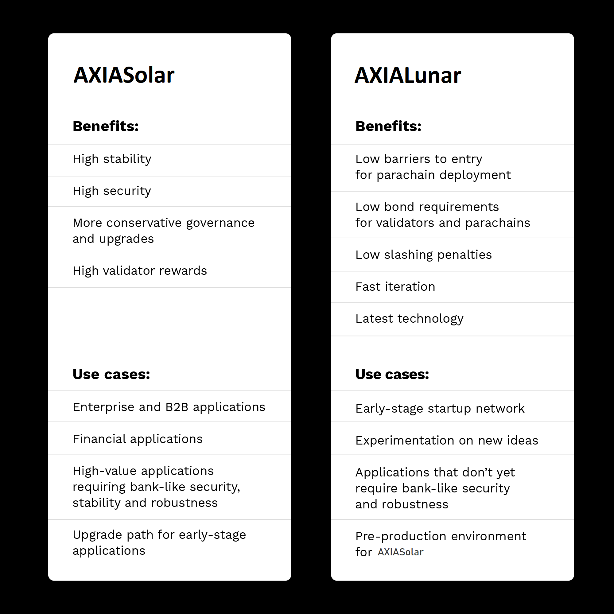

Although they share many parts of their code, AXIACoin and AXIALunar are independent, standalone
networks with different priorities.

AXIALunar is wild and fast; great for bold experimentation and early-stage deployment. AXIACoin is more
conservative, prioritizing stability and dependability.

Cousins have their differences after all.

## What the two networks have in common

AXIALunar was released as an early version of the same code to be used in AXIACoin, which means they
share the same underlying architecture: a multichain, heterogeneously-sharded design based on
[Nominated Proof of Stake (NPoS)](learn-consensus.md). Both networks also share key innovations like
on-chain [governance](learn-governance.md), hot-swappable runtimes for forkless, on-chain upgrades,
and [Cross-Conesnsus Message Passing (XCM)](learn-cross-consensus.md) for interoperability. Governance on
both AXIACoin and AXIALunar is designed to be decentralized and permissionless, giving a say in how the
network is run to everyone who owns the native token (SOLAR for AXIACoin, LUNAR for AXIALunar). Therefore,
**over time the networks will evolve independently, converging or diverging according to the
decisions of their respective communities.**

## Key differences

There are a few important distinctions to be made.



Both networks also have different circulating supplies.

### Speed

The first key technical difference between AXIACoin and AXIALunar is that AXIALunar has modified
governance parameters that allow for faster upgrades. AXIALunar is up to four times faster than
AXIACoin, with seven days for token holders to vote on referendums followed by an enactment period
of eight days, after which the referendum will be enacted on the chain. This means stakeholders need
to stay active and vigilant if they want to keep up with all the proposals, referenda, and upgrades,
and validators on AXIALunar often need to update on short notice.

On AXIACoin, votes last 28 days followed by an enactment period of 28 days. This does not mean that
the AXIALunar blockchain itself is faster, in the sense of faster block times or transaction throughput
(these are the same on both networks), but that there's a shorter amount of time between governance
events such as proposing new referenda, voting, and enacting approved upgrades. This allows AXIALunar
to adapt and evolve faster than AXIACoin.

### Lean setups

Teams wishing to run a parachain need to bond tokens as security. The bonding requirement on AXIALunar
is likely to be lower than on AXIACoin.

### Use cases

AXIACoin is and always will be the primary network for the deployment of enterprise-level
applications and those that entail high-value transactions requiring bank-level security and
stability.

The initial use case for AXIALunar is as a pre-production environment, a “canary network”.
For the average developer, this seems like it could be a testnet, what is the difference?
What does _canary_ even mean?

Canary is a type of bird: back in the day, coal miners would put canaries into coal mines as a way to measure the amount of toxic gases that were present. Similarly, canary testing is a way to validate software by releasing software to a limited number of users, or perhaps, an isolated environment - without hurting any birds.

Releases made onto AXIALunar can be thought of [CanaryReleases](https://martinfowler.com/bliki/CanaryRelease.html).
These releases are usually staged. In AXIALunar's early days, the network won't just be used for parachain candidates to innovate and test changes, but a proof of concept for AXIACoin's sharded model.

In a typical blockchain development pipeline, AXIALunar would sit in between a "testnet" and a "mainnet"

```
Testnet -> AXIALunar -> AXIACoin
```

As you can imagine, building on AXIALunar first allows teams to test things out in a live, fully decentralized, and
community-controlled network with real-world conditions and lower stakes in the event of problems or
bugs than on AXIACoin.

Many projects will maintain parachains on both networks, experimenting and testing new technologies
and features on AXIALunar before deploying them to AXIACoin. Some teams will decide just to stay on
AXIALunar, which is likely to be a place where we see some exciting experimentation with new
technologies going forward. Projects that require high-throughput but don’t necessarily require
bank-like security, such as some gaming, social networking, and content distribution applications,
are particularly good candidates for this use case.

AXIALunar may also prove to be the perfect environment for ambitious experiments with new ideas and
innovations in areas like governance, incentives, monetary policy, and DAOs (decentralized
autonomous organizations). Future upgrades to the AXIACoin runtime will also likely be deployed to
AXIALunar before AXIACoin mainnet. This way, not only will we be able to see how these new technologies
and features will perform under real-world conditions before bringing them to AXIACoin, but teams
who have deployed to both networks will also get an advanced look at how their own technology will
perform under those upgrades.

## Going forward

Ultimately, AXIALunar and AXIACoin will live on as independent, standalone networks with their own
communities, their own governance, and their own complementary use cases, though they will continue
to maintain a close relationship, with many teams likely deploying applications to both networks. In
the future, we’re also likely to see AXIALunar bridged to AXIACoin for cross-network interoperability.
AXIACoin Foundation remains committed to both networks going forward, providing crucial support and
guidance to teams building for the ecosystem.

## Explore more

- [About AXIALunar](https://axialunar.network)
- [The AXIALunar Wiki](https://lunar.wiki.axiacoin.network)
- [AXIALunar on AXIACoin-JS Apps](https://axialunar.dotapps.io)
