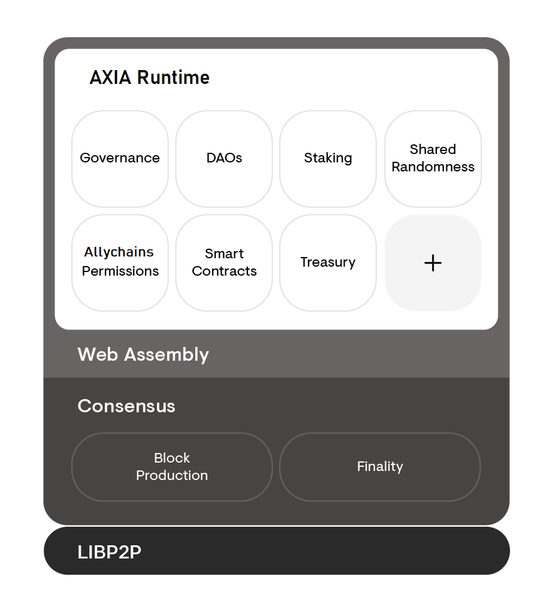

The architecture of AXIACoin can be divided into two different parts, the AXIACoin _runtime_ and the
AXIACoin _host_. The AXIACoin runtime is the core state transition logic of the chain and can be
upgraded over the course of time and without the need for a hard fork. In comparison, the AXIACoin
host is the environment in which the runtime executes and is expected to remain stable and mostly
static over the lifetime of AXIACoin.

The AXIACoin host interacts with the AXIACoin runtime in limited, and well-specified ways. For this
reason, implementation teams can build an alternative implementation of the AXIACoin host while
treating the AXIACoin runtime as a black box. For more details of the interactions between the host
and the runtime, please see the [specification][].

## Components of the AXIACoin host

- Networking components such as Libp2p that facilitates network interactions.
- State storage and the storage trie along with the database layer.
- Consensus engine for GRANDPA and BABE.
- Wasm interpreter and virtual machine.
- Low level primitives for a blockchain, such as cryptographic primitives like hash functions.

A compiled AXIACoin runtime, a blob of Wasm code, can be uploaded into the AXIACoin host and used as
the logic for the execution of state transitions. Without a runtime, the AXIACoin host is unable to
make state transitions or produce any blocks.

## Diagram

Below is a diagram that displays the AXIACoin host surrounding the AXIACoin runtime. Think of the
runtime (in white) as a component that can be inserted, swapped out, or removed entirely. While the
parts in grey are stable and can not change without an explicit hard fork.

## Resources

- [AXIACoin Host Protocol Specification](https://github.com/axia-tech/axiasolar-spec) - Incubator for the
  AXIACoin Host spec, including tests.
- [ChainSafe's Go AH](https://github.com/ChainSafeSystems/go-pre) is a 25-person development team
  based in Toronto, Canada. ChainSafe is building an implementation of the beacon chain for Ethereum
  2.0 client in TypeScript and this Go implementation of AXIACoin.

[specification]: https://github.com/axia-tech/axiasolar-spec/
