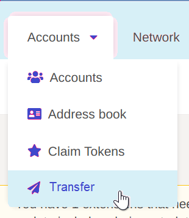
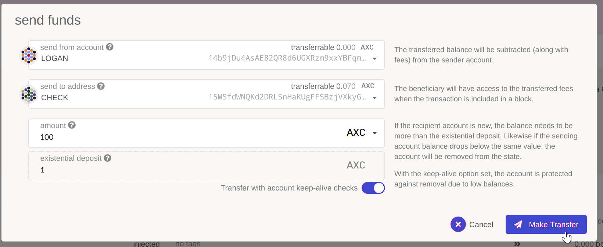

Balance transfers are used to send balance from one account to another account. To start
transferring balances, we will begin by using [AXIACoin-JS Apps][]. This guide assumes that you've
already [created an account](learn-account-generation.md) and have some funds that are ready to be
transferred.

## AXIACoin-JS Apps

> NOTE: In this walkthrough we will be using the AXIACoin network, but this is the same process for
> AXIALunar. If you would like to switch to a different network, you can change it by clicking the top
> left navigation dropdown and selecting a different network.

Let's begin by opening [AXIACoin-JS Apps][]. There are two ways to make a balance transfer:

1. By using the "Transfer" tab in the "Accounts" dropdown (located on the top navigational menu).
2. Clicking the "send" button while in the "Accounts" page.

### Using the Transfer Tab

Click on the "Transfer" tab in the "Accounts" dropdown.

Now a modal window will appear on the page. The modal asks you to enter 3 inputs:

- "send from account": Your account with funds that you will send from.
- "send to address": The address of the account that will receive the funds.
- "amount": The amount of tokens you will transfer.

The "existential deposit" box shows you the **minimum amount of funds you must keep in the account
for it to remain active.** See the [existential deposit][] section for more information.

After setting your inputs correctly, click the "Make Transfer" button and confirm. Once the transfer
is included in a block you will see a green notification in the top-right corner of your screen.

### Keep-Alive Checks

At an [extrinsic](../general/glossary.md#extrinsic) level, there are two main ways to transfer funds from one
account to another. These are `transfer` and `transfer_keep_alive`. `transfer` will allow you to
send SOLARs regardless of the consequence; `transfer_keep_alive` will not allow you to send an amount
that would allow the sending account to be removed due to it going below the existential deposit.

By default, AXIACoin-JS Apps will use `transfer_keep_alive`, ensuring that the account you send from
cannot drop below the existential deposit (1 SOLAR or 0.001666 LUNAR). However, it may be that you do
not want to keep this account alive (for example, because you are moving all of your funds to a
different address). In this case, click on the "keep-alive" toggle at the bottom of the modal
window. The label should switch from "Transfer with account keep-alive checks"(`transfer_keep_alive`
will be used) to "Normal transfer without keep-alive checks" (`transfer` extrinsic will be used). As
a common use case for using normal transfers is to entirely clear out the account, a second toggle
will appear if you have the keep-alive check turned off that will send all the tokens in the
account, minus a transaction fee, to the destination address.

Attempting to send less than the existential deposit to an account with 0 SOLAR will always fail, no
matter if the keep-alive check is on or not. For instance, attempting to transfer 0.1 SOLAR to an
account you just generated (and thus has no SOLAR) will fail, since 0.1 is less than the existential
deposit of 1 SOLAR and the account cannot be initialized with such a low balance.

> NOTE: Even if the transfer fails due to a keep-alive check, the transaction fee will be deducted
> from the sending account if you attempt to transfer.

### Existing Reference Error

<!-- These will be useful for future updates to this section: -->
<!-- https://github.com/substrate-developer-hub/substrate-developer-hub.github.io/issues/965 -->
<!-- https://github.com/axia-tech/axiasolar-wiki/issues/1101 -->

If you are trying to reap an account and you recieve an error similar to "There is an existing
reference count on the sender account. As such the account cannot be reaped from the state", then
you have existing references to this account that must first be removed before it can be reaped.
References may still exist from:

- Bonded tokens (most likely)
- Unpurged session keys (if you were prevously a validator)
- Token locks
- Existing recovery info
- Existing assets

#### Bonded Tokens

If you have tokens that are bonded, you will need to unbond them before you can reap your account.
Follow the instructions at [Unbonding and Rebonding](../maintain/maintain-guides-how-to-unbond.md) to check if
you have bonded tokens, stop nominating (if necessary) and unbond your tokens.

#### Purging Session Keys

If you used this account to set up a validator and you did not purge your keys before unbonding your
tokens, you need to purge your keys. You can do this by seeing the
[How to Stop Validating](../maintain/maintain-guides-how-to-stop-validating.md) page. This can also be checked
by checking `session.nextKeys` in the chain state for an existing key.

#### Checking for Locks

You can check for locks by querying `system.account(AccountId)` under `Developer > Chain state`.
Select your account, then click the "+" button next to the dropdowns, and check the relative `data`
JSON object. If you see a non-zero value for anything other than `free`, you have locks on your
account that need to get resolved.

You can also check for locks by navigating to `Accounts > Accounts` in
[AXIACoinJS Apps](https://axiasolar.js.org/apps/#/). Then, click the dropdown arrow of the relevant
account under the 'balances' column. If it shows that some tokens are in a 'locked' state, you can
see why by hovering over the information icon next to it.

#### Existing Recovery Info

Currently, {{ axiasolar: AXIACoin :axiasolar }} {{ axialunar: AXIALunar :axialunar }} does not use the
[Recovery Pallet](https://substrate.dev/docs/en/knowledgebase/runtime/frame#recovery), so this is
probably not the reason for your tokens having existing references.

{{ axialunar: On AXIALunar, you can check if recovery has been set up by checking the `recovery.recoverable(AccountId)`
chain state. This can be found under `Developer > Chain state` in [AXIACoinJS Apps][axiasolar-js apps]. :axialunar }}

#### Existing {{ axiasolar: Non-SOLAR :axiasolar }} {{ axialunar: Non-LUNAR :axialunar }} Assets

Currently, {{ axiasolar: AXIACoin :axiasolar }} {{ axialunar: AXIALunar :axialunar }} does not use the
[Assets Pallet](https://substrate.dev/docs/en/knowledgebase/runtime/frame#assets), so this is
probably not the reason for your tokens having existing references.

### From the Accounts Page

Navigate to the "Accounts" page by selecting the "Accounts" tab from the "Accounts" dropdown located
on the top navigational menu of AXIACoin-JS Apps.

You will see a list of accounts you have loaded. Click the "Send" button in the row for the account
you will like to send funds from.

Now you will see the same modal window as if using the "Transfer" tab. Fill in the inputs correctly
and hit "Make Transfer" then confirm the balance transfer. You will see a green notification in the
top-right corner of the screen when the transfer is included in a block.

[axiasolar-js apps]: https://axiasolar.js.org/apps
[existential deposit]: ../build/build-protocol-info.md#existential-deposit
