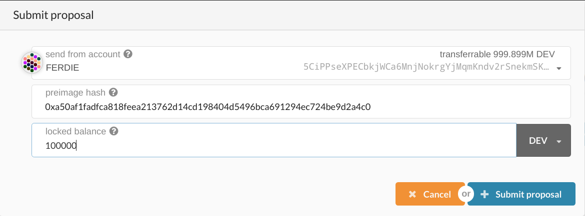
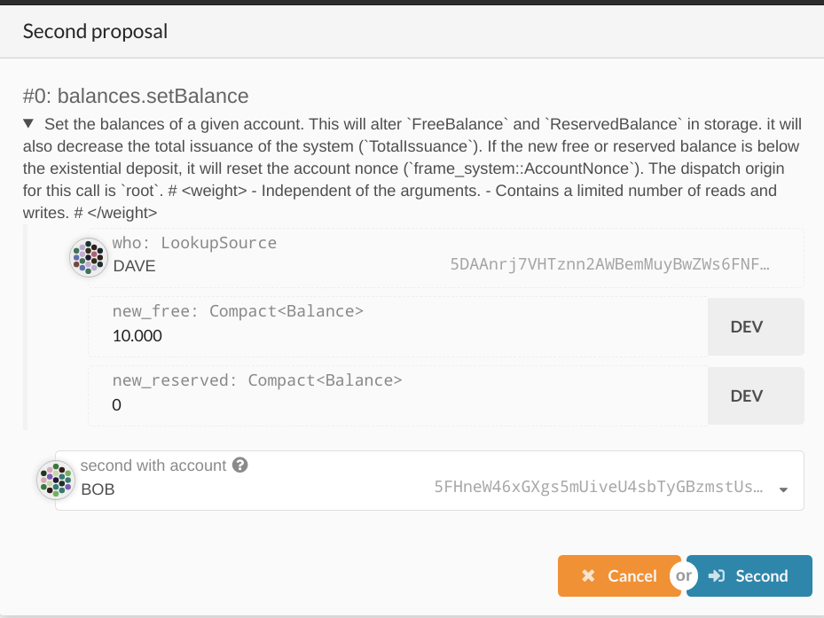
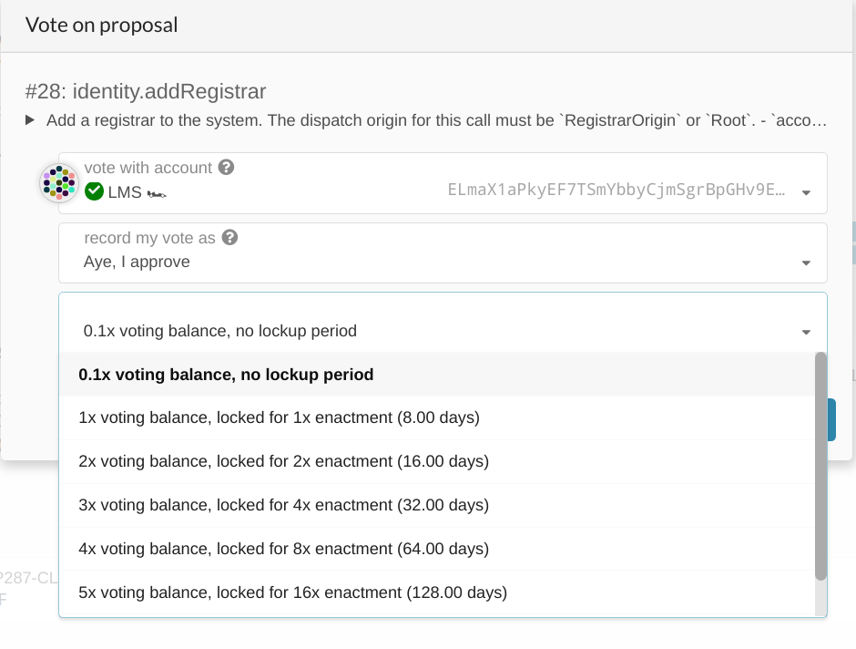
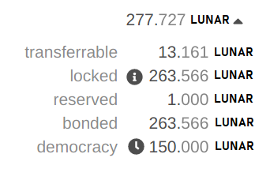
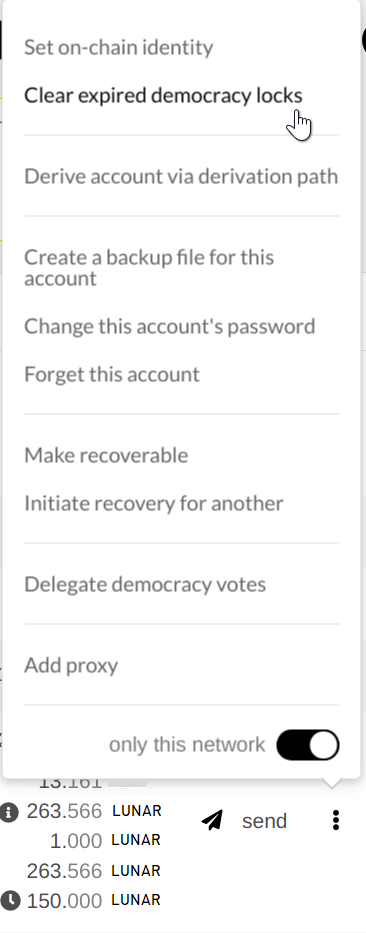

The public referenda chamber is one of the three bodies of on-chain governance as it's instantiated
in AXIASolar and AXIALunar. The other two bodies are the
[council](maintain-guides-how-to-join-council.md) and the
[technical committee](../learn/learn-governance.md#technical-committee).

Public referenda can be proposed and voted on by any token holder in the system as long as they
provide a bond. After a proposal is made, others can agree with it by _seconding_ it and putting up
tokens equal to the original bond. Every launch period, the most seconded proposal will be moved to
the public referenda table where it can be voted upon. Voters who are willing to lock up their
tokens for a greater duration of time can do so and get their vote amplified. For more details on
the governance system please see [here](../learn/learn-governance.md).

This guide will instruct token holders how to propose and vote on public referenda using the
Democracy module as it's implemented in AXIALunar.

## Important Parameters

The important parameters to be aware of when voting using the Democracy module are as follow:

**Launch Period** - How often new public referenda are launched.

**Voting Period** - How often votes for referenda are tallied.

**Emergency Voting Period** - The minimum voting period for a fast-tracked emergency referendum.

**Minimum Deposit** - The minimum amount to be used as a deposit for a public referendum proposal.

**Enactment Period** - The minimum period for locking funds _and_ the period between a proposal
being approved and enacted.

**Cooloff Period** - The period in blocks where a proposal may not be re-submitted after being
vetoed.

## Proposing an Action

Proposing an action to be taken requires you to bond some tokens. In order to ensure you have enough
tokens to make the minimum deposit you can check the parameter in the chain state. The bonded tokens
will only be released once the proposal is tabled (that is, brought to a vote); there is no way for
the user to "revoke" their proposal and get the bond back before it has become a referendum. Since
it is essentially impossible to predict definitely when a proposal may become a referendum (if
ever), this means that any tokens bonded will be locked for an indeterminate amount of time.

> Proposals cannot be revoked by the proposer, even if they never turn into a referendum. It is
> important to realize that there is no guarantee that SOLAR you use for proposing or seconding a
> proposal will be returned to that account in any given timeframe.

On AXIASolar Apps you can use the "Democracy" tab to make a new proposal. In order to submit a
proposal, you will need to submit what's called the preimage hash. The preimage hash is simply the
hash of the proposal to be enacted. The easiest way to get the preimage hash is by clicking on the
"Submit preimage" button and configuring the action that you are proposing.

For example, if you wanted to propose that the account "Dave" would have a balance of 10 tokens your
proposal may look something like the below image. The preimage hash would be
`0xa50af1fadfca818feea213762d14cd198404d5496bca691294ec724be9d2a4c0`. You can copy this preimage
hash and save it for the next step. There is no need to click Submit Preimage at this point, though
you could. We'll go over that in the next section.


Now you will click on the "Submit proposal" button and enter the preimage hash in the input titled
"preimage hash" and _at least_ the minimum deposit into the "locked balance" field. Click on the
blue "Submit proposal" button and confirm the transaction. You should now see your proposal appear
in the "proposals" column on the page.



Now your proposal is visible by anyone who accesses the chain and others can second it or submit a
preimage. However, it's hard to tell what exactly this proposal does since it shows the hash of the
action. Other holders will not be able to make a judgement for whether they second it or not until
someone submits the actual preimage for this proposal. In the next step you will submit the
preimage.


## Submitting a Preimage

The act of making a proposal is split from submitting the preimage for the proposal since the
storage cost of submitting a large preimage could be pretty expensive. Allowing for the preimage
submission to come as a separate transaction means that another account could submit the preimage
for you if you don't have the funds to do so. It also means that you don't have to pay so many funds
right away as you can prove the preimage hash out-of-band.

However, at some point before the proposal passes you will need to submit the preimage or else the
proposal cannot be enacted. The guide will now show you how to do this.

Click on the blue "Submit preimage" button and configure it to be the same as what you did before to
acquire the preimage hash. This time, instead of copying the hash to another tab, you will follow
through and click "Submit preimage" and confirm the transaction.


Once the transaction is included you should see the UI update with the information for your already
submitted proposal.


## Seconding a Proposal

Seconding a proposal means that you are agreeing with the proposal and backing it with an equal
amount of deposit as was originally locked. The bonded tokens will be released once the proposal is
tabled (that is, brought to a vote), just like the original proposer's bond. By seconding a proposal
you will move it higher up the rank of proposals. The most seconded proposal &mdash; in value, not
number of supporters &mdash; will be brought to a referendum every launch period.

It is important to note that there is no way to stop or cancel seconding a proposal once it has been
done. Therefore, the SOLAR that was seconded will be reserved until the proposal is tabled as a
referendum. This is an indeterminate amount of time, since there is no guarantee that a proposal
will become a referendum for a given period, as other proposals may be proposed and tabled before
it.

Note that it is possible for a single account to second a proposal multiple times. This is by
design; it is the value, not the number of seconds _per se_, that counts in terms of weighting. If
there were a limit of one second per account, it would be trivial for a user with, for example, 1000
SOLAR to create ten accounts with 100 SOLAR instead of a single account with 1000 SOLAR. Thus, no
restrictions are made on the number of times a single account can second a proposal.

To second a proposal, navigate to the proposal you want to second and click on the "Second" button.


You will be prompted with the full details of the proposal (if the preimage has been submitted!) and
can then broadcast the transaction by clicking the blue "Second" button.



Once successful you will see your second appear in the dropdown in the proposal details.


## Voting on a Proposal

At the end of each launch period, the most seconded proposal will move to referendum. During this
time you can cast a vote for or against the proposal. You may also lock up your tokens for a greater
length of time to weigh your vote more strongly. During the time your tokens are locked, you are
unable to transfer them, however they can still be used for further votes. Locks are layered on top
of each other, so an eight week lock does not become a 15 week lock if you vote again a week later,
rather another eight week lock is placed to extend the lock just one extra week.

To vote on a referendum, navigate to the
["Democracy" tab of AXIASolar Apps](https://axiasolar.js.org/apps/#/democracy/). Any active referendum
will show in the "referenda" column. Click the blue button "Vote" to cast a vote for the referendum.

If you would like to cast your vote for the proposal select the "Aye, I approve" option. If you
would like to cast your vote against the proposal in referendum you will select "Nay, I do not
approve" option.

The second option is to select your conviction for this vote. The longer you are willing to lock
your tokens, the stronger your vote will be weighted. The timeline for the conviction starts after
the voting period ends; tokens used for voting will always be locked until the end of the voting
period, no matter what conviction you vote with. Unwillingness to lock your tokens means that your
vote only counts for 10% of the tokens that you hold, while the maximum lock up of 896 days means
you can make your vote count for 600% of the tokens that you hold.

When you are comfortable with the decision you have made, click the blue "Vote" button to submit
your transaction and wait for it to be included in a block.



## Unlocking Locked Tokens

Like [vesting](../learn/learn-SOLAR.md#lazy-vesting), the tokens that are locked in democracy are unlocked
lazily. This means that you, the user, must explicitly call an unlock extrinsic to make your funds
available again after the lock expires. Unbonding is another term you hear a lot in AXIASolar, it
means withdrawing your SOLAR that was used in staking. To know more about it, please see
[here](maintain-guides-how-to-unbond.md).

You can do this from the "Accounts" page in
[AXIASolar-JS Apps](https://axiasolar.js.org/apps/#/accounts), unless you use Ledger (see below).
First check that your account has a "democracy" lock by opening the details on your balance. In the
example below the account has 150 LUNAR locked in democracy.



Now you can click the menu button on Apps and find the option that says "Clear expired democracy
locks". After selecting this option you may confirm the transaction and your locks will be cleared
when successful.



#### With a Ledger hardware wallet or Unlocking Very Old Locks

If you do not see an option to clear expired democracy votes, it may be that the lock is very old.
Or, if you are using the Ledger hardware wallet, you will not be able to issue the batch Unlock
action from the UI.

Instead, you must clear the lock by directly issuing the correct extrinsics.

Navigate to the [Extrinsics page](https://axiasolar.js.org/apps/#/extrinsics) and submit the
following extrinsic: `democracy.removeVote(index)` using the account that you voted with. For the
index number (ReferendumIndex), enter the number of the referendum for which you voted ("12" in the
image below).

The number of the referendum for which you voted is visible in an explorer such as Polkascan.

You need to press the "Submit Transaction" button to submit the extrinsic.


Now submit the following extrinsic: `democracy.unlock(target)`, where target is your your account
address.


If you return to the [Accounts page](https://axiasolar.js.org/apps/#/accounts), you should see that
the democracy lock has been released.

Note that this applies only to locked SOLAR that were used for voting on referenda. In order to unlock
SOLAR locked by voting for members of the AXIASolar Council, you need to go to the
[Council](https://axiasolar.js.org/apps/#/council) page, click "Vote", and then click on "Unvote
All".

## Delegate a Vote

If you are too busy to keep up and vote on upcoming referenda, there is an option to delegate your
vote to another account whose opinion you trust. When you delegate to another account, that account
gets the added voting power of your tokens along with the conviction that you set. The conviction
for delegation works just like the conviction for regular voting, except your tokens may be locked
longer than they would normally since locking resets when you undelegate your vote.

The account that is being delegated to does not make any special action once the delegation is in
place. They can continue to vote on referenda how they see fit. The difference is now when the
Democracy system tallies votes, the delegated tokens now are added to whatever vote the delegatee
has made.

You can delegate your vote to another account and even attach a "Conviction" to the delegation.
Navigate to the "Extrinsics" tab on AXIASolar Apps and select the options "democracy" and "delegate".
This means you are accessing the democracy pallet and choosing the delegate transaction type to
send. Your delegation will count toward whatever the account you delegated for votes on until you
explicitly undelegate your vote.

In the first input select the account you want to delegate to and in the second input select the
amount of your conviction. Remember, higher convictions means that your vote will be locked longer.
So choose wisely!


After you send the delegate transaction, you can verify it went through by navigating to the "Chain
State" tab and selecting the "democracy" and "delegations" options. You will see an output similar
to below, showing the addresses to which you have delegated your voting power.


## Undelegate a Vote

You may decide at some point in the future to remove your delegation to a target account. In this
case, your tokens will be locked for the maximum amount of time in accordance with the conviction
you set at the beginning of the delegation. For example, if you chose "2x" delegation for four weeks
lock up time, your tokens will be locked for 4 weeks after sending the `undelegate` transaction.
Once your vote has been undelegated, you are in control of making votes with it once again. You can
start to vote directly, or chose a different account to act as your delegate.

The `undelegate` transaction must be sent from the account that you wish to clear of its delegation.
For example, if Alice has delegated her tokens to Bob, Alice would need to be the one to call the
`undelegate` transaction to clear her delegation.

The easiest way to do this is from the "Extrinsics" tab of AXIASolar Apps. Select the "democracy"
pallet and the "undelegate" transaction type. Ensure that you are sending the transaction from the
account you want to clear of delegations. Click "Submit transaction" and confirm.


## Voting with a Governance Proxy

Making a vote on behalf of a stash requires a "proxy" transaction from the Proxy pallet. When you
choose this transaction from the "Extrinsics" tab, it will let you select "vote" from the Democracy
pallet, and you will specify the index of the referendum that is being voted, the judgement (i.e.
"Aye" for approval or "Nay" for rejection), and the conviction, just like a normal vote.

For more material on adding and removing Governance proxies, as well as other types, please see the
[Proxy page](../learn/learn-proxies.md).

## Interpreting On-Chain Voting Data

Consider the following example showcasing how votes would be displayed on a block explorer.

```
Nay 0.1x => 0
Nay 1x => 1
Nay 2x => 2
Nay 3x => 3
Nay 4x => 4
Nay 5x => 5
Nay 6x => 6
Aye 0.1x => 128
Aye 1x => 129
Aye 2x => 130
Aye 3x => 131
Aye 4x => 132
Aye 5x => 133
Aye 6x => 134
```

At first glance, it may be difficult to interpret what you voted on. We need to take a step back and
consider the "voting data" at the binary level.

The vote is stored as a byte using a bitfield data structure and displayed on the block explorer as
a decimal integer. The bitfield stores both the conviction and aye/nay boolean, where the boolean is
represented using the MSB of the byte. This would mean that the grouping of the 7 remaining bits is
used to store the conviction.
